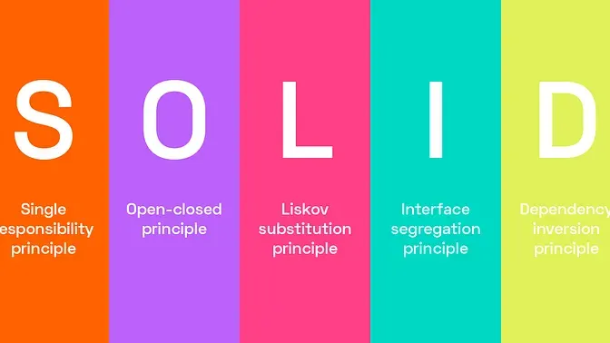

---
date:
  created: 2025-02-04
authors:
  - alberto
categories:
  - Alberto Sanches
comments: true
slug: solid
tags:
  - Desenvolvimento de Software
  - Boas Práticas
  - Engenharia de Software
  - Clean Code
  - Agilidade
---

# A Importância do SOLID no Desenvolvimento de Software: Construindo Códigos Sustentáveis e Escaláveis

No mundo do desenvolvimento de software, a qualidade do código é um dos pilares fundamentais para o sucesso de qualquer projeto. À medida que os sistemas se tornam mais complexos e as demandas por novas funcionalidades aumentam, a necessidade de escrever código que seja fácil de manter, escalar e entender se torna cada vez mais crítica. É aqui que os princípios SOLID entram em cena, oferecendo diretrizes valiosas para desenvolvedores que desejam criar soluções robustas e sustentáveis.

<!-- more -->

## O que é SOLID?

SOLID é um acrônimo que representa cinco princípios de design de software, introduzidos por Robert C. Martin (também conhecido como Uncle Bob). Esses princípios visam melhorar a estrutura do código, facilitando a manutenção, a extensibilidade e a reutilização. Vamos explorar cada um deles:

### 1. S - Single Responsibility Principle (Princípio da Responsabilidade Única)

Uma classe deve ter apenas uma razão para mudar, ou seja, deve ter uma única responsabilidade. Isso torna o código mais coeso e fácil de entender, já que cada classe tem um propósito bem definido.

### 2. O - Open/Closed Principle (Princípio Aberto/Fechado)

Entidades de software (classes, módulos, funções) devem estar abertas para extensão, mas fechadas para modificação. Isso significa que você deve ser capaz de adicionar novas funcionalidades sem alterar o código existente, promovendo a reutilização e reduzindo o risco de introduzir bugs.

### 3. L - Liskov Substitution Principle (Princípio da Substituição de Liskov)

Objetos de uma classe derivada devem ser capazes de substituir objetos da classe base sem alterar a corretude do programa. Em outras palavras, as subclasses devem ser substituíveis por suas classes base sem causar comportamentos inesperados.

### 4. I - Interface Segregation Principle (Princípio da Segregação de Interfaces)

Interfaces devem ser específicas para as necessidades dos clientes que as utilizam. Em vez de criar interfaces grandes e genéricas, é preferível criar várias interfaces menores e mais especializadas, evitando que as classes implementem métodos que não utilizam.

### 5. D - Dependency Inversion Principle (Princípio da Inversão de Dependência)

Módulos de alto nível não devem depender de módulos de baixo nível. Ambos devem depender de abstrações. Além disso, abstrações não devem depender de detalhes. Detalhes devem depender de abstrações. Esse princípio promove o desacoplamento e facilita a testabilidade e a manutenção do código.

## Por que SOLID é importante?

Aplicar os princípios SOLID no desenvolvimento de software traz uma série de benefícios:

- **Facilita a Manutenção:** Código que segue os princípios SOLID é mais fácil de entender e modificar, reduzindo o tempo e o esforço necessários para implementar mudanças.

- **Promove a Reutilização:** Ao seguir o princípio da responsabilidade única e da segregação de interfaces, você cria componentes que podem ser reutilizados em diferentes partes do sistema ou até mesmo em projetos diferentes.

- **Aumenta a Escalabilidade:** O princípio aberto/fechado e a inversão de dependência permitem que o sistema cresça de forma sustentável, sem a necessidade de reescrever grandes partes do código.

- **Melhora a Testabilidade:** Código desacoplado e coeso é mais fácil de testar, o que resulta em um software mais confiável e com menos bugs.

## Desafios e Considerações

Embora os princípios SOLID sejam extremamente úteis, é importante lembrar que eles não são uma solução mágica para todos os problemas de design de software. Aplicá-los de forma rígida e sem considerar o contexto pode levar a um excesso de complexidade e a um aumento desnecessário no número de classes e interfaces. Portanto, é crucial encontrar um equilíbrio e aplicar esses princípios de forma pragmática, sempre considerando as necessidades específicas do projeto.

## Conclusão

No cenário atual de desenvolvimento de software, onde a agilidade e a qualidade são essenciais, os princípios SOLID se destacam como ferramentas poderosas para criar sistemas que são não apenas funcionais, mas também sustentáveis e escaláveis. Ao adotar essas práticas, os desenvolvedores podem construir códigos que resistem ao teste do tempo, facilitando a evolução contínua dos sistemas e garantindo a satisfação dos usuários e stakeholders.

E você, como tem aplicado os princípios SOLID no seu dia a dia? Compartilhe suas experiências e insights nos comentários! Vamos trocar ideias e aprender juntos. 