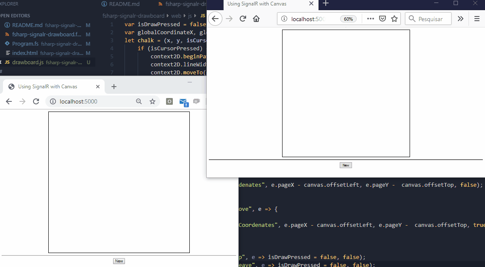

---
date:
  created: 2019-06-26
authors:
  - diego
categories:
  - Diego Costa
comments: true
slug: mesa-desenho-fsharp
---

# Criando mesa de desenho em tempo real com F#, SignalR e Javascript

Esse é um pequeno tutorial de como usar F# e SignalR dentro da plataforma .NET Core 3 (preview 6), escolhi o F# para esse tutorial por ser uma linguagem com declarações mais simples que o C# e por trabalhar com tipo seguros. O F# tem crescido muito como referência em programação funcional e multi-paradigma, a intenção desse material não é se aprofundar nos conceitos envolvendo a linguagem F# mas demonstrar sua simplicidade em um programa .NET Core.

<!-- more -->

## Um pouco de SignalR e realtime…

O SignalR é uma biblioteca que permite suporte a aplicativos em tempo real muito similar ao Socket.IO (Node.js) ou Tornado (Python) ela é usada para troca de informações de forma assíncrona usando modos de transporte como LongPolling, WebSockets, FlashSocket entre outras estratégias de que simulam troca de informações em tempo real sem necessidade de uma nova requisição http, de acordo com o tipo de navegador o SignalR escolhe a melhor forma de estabelecer a comunicação usando interfaces entre servidor (F#) e cliente (Javascript) enviando mensagens por subprotocolos como ws ou técnicas como push e long polling, essa troca de informações é bem mais rápida que uma requisição http convencional simulando o comportamento de uma conexão contínua.

## Iniciando o projeto

O objetivo desse artigo é demonstrar o uso do .NET Core como ferramenta opensource por isso não será abordado o uso do Visual Studio ou VS Code, o desenvolvedor pode facilmente executar esse exemplo no Mac, Windows ou Linux mesmo com um simples editor de textos.

1. Abrir o terminal e digitar o comando abaixo:

```
dotnet new console -lang F# -o fsharp-signalr-drawboard
```

Esse comando criará um novo projeto do tipo console script com a linguagem F#.

2. Depois digitar os seguintes comandos:

```
cd fsharp-signalr-drawboard
dotnet add package Microsoft.AspNetCore.App
dotnet add package Giraffe
dotnet add package Microsoft.AspNetCore.SignalR
```

Os comandos acima são necessários para instalar as dependências usadas nesse projeto.

## Servidor

Na raiz do diretório do projeto existe um arquivo chamado **Program.fs** esse é o script F# criado por padrão ao iniciar o console script, vamos realizar toda implementação servidor a partir desse arquivo.

<script src="https://gist.github.com/diegobassay/e911cefcd37e9410d45d946063b6379f.js"></script>

Precisamos adicionar as configurações de middleware, o middleware é a implementação da configuração de recursos e serviços usados no ASP.NET Core fazendo com que comportamentos sejam modificados ou personalizados de acordo com a necessidade da aplicação.

Agora vamos substituir o “Hello World” padrão e criar algumas declarações no código:

<script src="https://gist.github.com/diegobassay/6fc0cd77d051738d0edb6ae2a8e5d933.js"></script>

Acima foi declarado um type chamado **Startup** que funciona de acordo com as mesmas convenções do ASP.NET Core esse type é onde são configurados os recursos de componentes e serviços usados no aplicativo, dentro do type **Startup** são reescritos comportamentos através do **ConfigureServices** que usa o recursos do namespace **Microsoft.Extensions.DependencyInjection** onde é iniciado o uso do Giraffe adicionando-o como serviço via injeção de dependência pelo **IServiceCollection** na linha 13, porém vamos usar apenas o **Kestrel** para conteúdo estático, usar o Giraffe para declarar conteúdo estático foi mais complexo que o esperado saindo assim do foco desse tutorial, mesmo assim permanece a configuração do Giraffe apenas para fins de referência, é possível testar o servidor web usando a rota Giraffe acessando http://localhost:5000/about.

Na linha 15 temos a sobrescrita do método **Configure**, onde vamos declarar todas configurações de middleware as quais processam as solicitações HTTP que são enviadas para a aplicação, essas configurações estão disponibilizadas através do namespace **Microsoft.AspNetCore.Builder**, o uso das chamadas das funções **UseDefaultFiles()** e **UseStaticFiles()** através da instância atual do **IApplicationBuilder** faz com que as requisições processem arquivos com nomes padronizados como **index.html** e **default.html** além de habilitar o uso de arquivos estáticos, na linha 17 é configurado o uso do Giraffe com as rotas declaradas na linha 7.

Na linha 20 a função **main** será o ponto de início para executar servidor web, nas linhas 21 e 22 são usados **Directory** e **Path** para obter o contexto do diretório da aplicação e criar um diretório que irá hospedar os arquivos estáticos (reescrevendo **wwwroot**), na linha 23, o **WebHostBuilder** (**Microsoft.AspNetCore.Hosting**) é usado para inicializar o servidor web, na chamada a **UseWebRoot()** vamos definir um novo diretório para nosso conteúdo estático no caso o diretório **“web”** e iniciar as configurações de inicialização personalizadas no type Startup com a chamada **UseStartup<Startup>()**.

Antes de configurar os arquivos e diretórios do lado cliente vamos primeiro implementar o SignalR na aplicação.

## Criando e configurando os componentes do SignalR

O SignalR possui dois tipos de componentes para consumir ou produzir informações de uma conexão:

- PersistentConnection
- Hub

O PersistentConnection trabalha em um nível mais baixo de abstração envolvendo todas as conexões enviadas aos clientes conectados ao broadcast, suas mensagens são enviadas de maneira genérica tendo que ser tratadas de formas diferentes do lado cliente.

O Hub funciona em um nível mais alto de abstração e pode ser estendido por classes especializadas, os Hubs são construídos por cima do PersistentConnection e são usados para permitir a chamada de métodos tanto no cliente quanto no servidor.

No código abaixo vamos adicionar um Hub ao servidor web:

<script src="https://gist.github.com/diegobassay/b99b263242db6474438f84451db55e97.js"></script>

No código acima na linha 11 foi declarada a interface **InterfaceClientOperations** que possui um método abstrato chamado **ReceiveCoordenates** esse é o método que define como será o formato do callback que espera receber as informações no cliente, o contrato do método **ReceiveCoordenates** é declarado usando uma tupla como parâmetro, no F# assim como em Swift e Python você pode definir tuplas e esse tipo é o padrão usado para o SignalR enviar informações no formato em um tipo seguro para o cliente em javascript de forma ordenada e estruturada.

Na linha 14 foi declarado o type **DrawBoardHub** ele herda da classe Hub do namespace **Microsoft.AspNetCore.SignalR.Hub**, o **DrawBoardHub** é o principal componente que representa toda comunicação entre cliente e servidor, esse Hub é declarado usando como parâmetro genérico o type **InterfaceClientOperations** essa é a referência que o SignalR usa para construir as operações de eventos no lado cliente.

Na linha 17 ainda no **DrawBoardHub** foi declarado o método **SendCoordenates** esse é o método que é invocado do lado cliente através do Javascript para enviar as informações de coordenadas que são emitidas para todos os clientes pela chamada ao **ReceiveCoordenates** na linha 19.

Na linha 24 declaramos que o SignalR será usado como serviço na aplicação.

Na linha 31 vamos chamar **UseSignalR** no método **Startup.Configure** isso vai mapear a única configuração necessária que vai definir a rota que representa a conexão com o **DrawBoardHub** através do cliente, a variável routes representa a instância do **HubRouteBuilder** onde ocorre a chamada ao método **MapHub** esse método recebe como tipo genérico o **DrawBoardHub** e como argumento o **PathString** para mapear a url de acesso **“/drawBoardHub”**.

## Cliente

Agora vamos criar a estrutura que será exibida pelo browser, digite os seguintes comandos na raiz do projeto:

```
mkdir web
cd web
echo.> index.html
mkdir js
cd js
echo.> drawboard.js
```

Na raiz do projeto digite os comandos abaixo para instalar o pacote cliente do SignalR e copiar para o diretório web:

```
npm init -y 
npm install @aspnet/signalr
cd node_modules/@aspnet/signalr/dist/browser/
move signalr.js ../../../../../web
```

A estrutura da pasta web deve ficar conforme abaixo:

```
web
├── js/
│   ├── drawboard.js
│   └── signalr.js
└── index.html
```

Vamos adicionar o conteúdo do **index.html**, a tag canvas é a responsável por exibir o desenho feito a partir das coordenadas enviadas pelo SignalR que foram capturadas por eventos do mouse, a tag button é usada para apagar o desenho na canvas e são declarados duas tags script:

<script src="https://gist.github.com/diegobassay/3712e49ebbf04b6e56a7a0e803ab13cb.js"></script>

O primeiro script (**signalr.js**) é o pacote cliente do SignalR e o segundo script (**drawboard.js**) é onde ficam as implementações que fazem o desenho funcionar.

Vamos implementar o código necessário ao projeto:

<script src="https://gist.github.com/diegobassay/d16e2d86171c92089ea148a458d5e413.js"></script>

Vamos começar declarando as variáveis globais, a flag **isDrawPressed** é iniciada como false, as variáveis **globalCoordinateX**, **globalCoordinateY**, **context2D**, **canvas** também são declaradas em escopo global.

A função **chalk** na linha 3 é a responsável por fazer o desenho no canvas, se o cursor estiver pressionado essa função modifica o contexto de renderização 2D obtido na linha 18 com as coordenadas, a chamada para **beginPath()** inicia uma nova sessão onde serão informados os caminhos que serão desenhados por meio de coordenadas, a propriedade **lineWidth** é onde é configurada o tamanho da linha desenhada, as chamadas para **moveTo** e **lineTo** funcionam em conjunto, enquanto **moveTo** define o canvas com a coordenada enviada no evento anterior o **lineTo** um traça uma linha até a coordenada enviada no evento atual o **closePath()** encerra a definição de traço e o **stroke()** escreve o desenho na superfície do canvas, se o cursor não estiver pressionado a função **chalk** seta os valores das últimas coordenadas enviadas para as variáveis globais.

Na linha 16 é onde ocorre a construção da conexão com os Hubs do SignalR, o objeto **HubConnectionBuilder** inicia um objeto de conexão com o Hub que foi mapeado do lado servidor pela url **“/drawBoardHub”**.

As linhas 17 e 18 eu obtenho por id a tag canvas e dentro dela o contexto de renderização 2D.

Nas linhas seguintes ocorrem a captura do eventos do mouse sobre a tag canvas e o envio de das coordenadas para o servidor, na linha 20 adicionado o **“mousedown”**, no callback desse evento a variável **isDrawPressed** é defina como true, na linha 22 ocorre o envio das coordenadas ao Hub a função **invoke** recebe 4 argumentos o nome do método definido no Hub que será invocado, seus parâmetros x, y e a flag que indica se o mouse está pressionado, o valor do segundo argumento é o número em pixels da coordenada horizontal do mouse relativa ao documento menos o número de pixels do canto superior esquerdo do elemento obtendo a coordenada x, o terceiro argumento é o número em pixels da coordenada vertical do mouse relacionada ao documento menos o número de pixels do canto superior direto do elemento canvas, obtendo assim a coordenada y, o quarto argumento é definido que o mouse ainda não foi pressionado para que possa sempre obter uma coordenada diferente no desenho entre o moveTo e lineTo. Na linha 25 é definido evento o **“mousemove”** sobre a tag canvas, nesse evento para que se envie mensagens com coordenadas para o Hub é necessário a que flag **isDrawPressed** seja true o que ocorre no evento **“mousedown”**, as coordenadas são obtidas exatamente como no evento anterior e o quarto argumento enviado ao **SendCoordenates** informa que dessa vez o cursor está pressionado, nas linhas 31 e 33 são definidos os eventos **“mouseup”** e **“mouseleave”** eles atribuem o valor de **isDrawPressed** como false terminando o ciclo do desenho.

A linha 35 é para define que ao clicar no botão New o contexto de renderização 2D da canvas será apagado.

A linha 39 é onde o evento **ReceiveCoordenates** escuta as mensagens respondidas pelo SignalR, aqui são recebidas as coordenadas enviadas pelo SignalR e ocorre a chamada a função **chalk** que desenha no canvas.

A linha 43 é onde ocorre o inicio da conexão com SignalR a partir do objeto definido na linha 16.

## Para testar

1. Abrir o terminal e ir para raiz do projeto e digitar o comando abaixo:

```
dotnet run
```

2. Acessar http://localhost:5000 em dois navegadores diferentes.

O resultado final será conforme demonstrado abaixo:



O código completo do projeto pode ser encontrado nesse [link](https://github.com/diegobassay/fsharp-signalr-drawboard).

## Referências e Leitura Adicional

- https://docs.microsoft.com/pt-br/aspnet/core/signalr/configuration?view=aspnetcore-3.0
- https://docs.microsoft.com/pt-br/aspnet/core/fundamentals/servers/kestrel?view=aspnetcore-3.0
- https://devblogs.microsoft.com/dotnet/announcing-f-4-6

*_texto original publicado em [medium.com](https://medium.com/@diegobassay/criando-mesa-de-desenho-em-tempo-real-com-f-signalr-e-javascript-b24bf77c052c)*