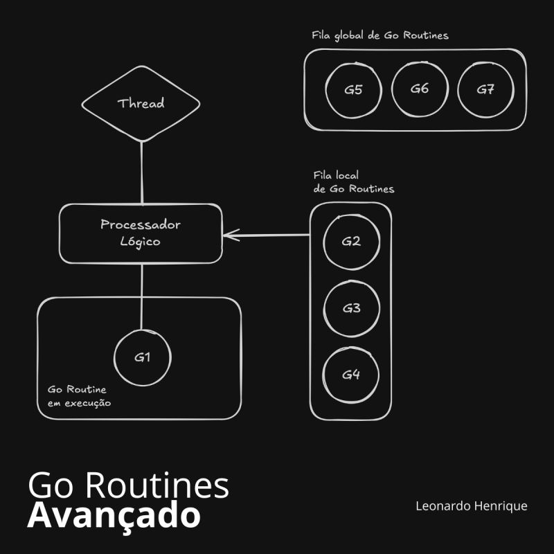

---
date:
  created: 2025-05-21
authors:
  - leonardo-henrique
categories:
  - Leonardo Henrique
comments: true
slug: in-go
tags:
  - SRE
  - Desenvolvimento
  - GO
---

# Você conhece a maneira fantástica com que Go gerencia concorrência?

Para vagas pleno/senior de Dev Go é importante que saiba como funciona a gestão de Go routines por baixo dos panos. 

<!-- more -->

Mas antes vamos relembrar 2 conceitos importantes:

Paralelismo ➡️ Múltiplas atividades são realizadas ao mesmo tempo (em geral em sistemas com mais de um processador físico)

Concorrência ➡️ Múltiplas atividades competem pelo tempo de CPU, cada atividade recebe uma fração de tempo de processamento e vão intercalando suas execuções até serem concluídas

Go Routines permitem que seu código seja concorrente, evitando-se travamentos/esperar desnecessárias em sua app.

Imagine a situação: você precisa enviar cartas para 10 parentes. 

Opção 1: você vai aos Correios, envia a primeira carta e permanece lá até que a resposta do seu parente retorne. Você faz isso para todas as cartas.

Opção 2:você vai aos Correios, envia todas as cartas de uma só vez e volta para casa para esperar pelas respostas, conforme chegarem.

Muito melhor você disparar as cartas e ir para casa, não é mesmo? Essa é a ideia de concorrência!

Por quê bloquear a execução de nosso programa por conta de atividades que não precisamos necessariamente ficar esperando o retorno?

Em Go, basta adicionar a instrução go antes das funções e já estaremos fazendo uso de concorrência. Neste momento, entra em cena o Go Runtime Scheduler. Ele é responsável por fazer a gestão das Go Routines, decidindo qual deve obter a fatia do tempo de processamento, qual deve esperar e assim por diante.

Temos 3 componentes principais neste processo:

▶️ Go Routine: nossa unidade de código que concorrerá pela CPU
▶️ Processadores lógicos: anexados cada um a uma única thread do sistema operacional [por padrão, cada processador lógico fica vinculado a um processador físico]
▶️ Threads do S.O.: infraestrutura que suportará a execução das Go Routines

Assim que criamos uma nova go func, 

1️⃣ O Go Runtime Scheduler vai criar uma nova Go Routine e enviá-la para um fila local que fica referenciada em um dos processadores lógicos. Caso essa fila esteja cheia, o Scheduler enviará a Go Routine para uma fila global.

2️⃣ Assim que estiver pronta para ser executada, a Go Routine será enviada para o processador lógico e então ocorrerá seu processamento.

3️⃣ Caso a Go Routine realize uma ação bloqueante como ler um arquivo (no nosso exemplo prático, seria algo como enviar uma carta e esperar seu retorno) o Go Runtime Scheduler vai liberar a thread + Go Routine bloqueante e solicitar uma nova thread para o processador lógico. Dessa forma o sistema não para.

E aí, já usou Go Routines em algum projeto? Comente sobre suas experiências ou dúvidas!

*_texto original publicado em [linkedin.com](https://www.linkedin.com/posts/leonardohenrique1_voc%C3%AA-conhece-a-maneira-fant%C3%A1stica-com-que-activity-7311813584139837440-oIdr?utm_source=share&utm_medium=member_desktop&rcm=ACoAAA8mACgBW3pozo66eL_dSeG0qaYo8uLUdBE)*