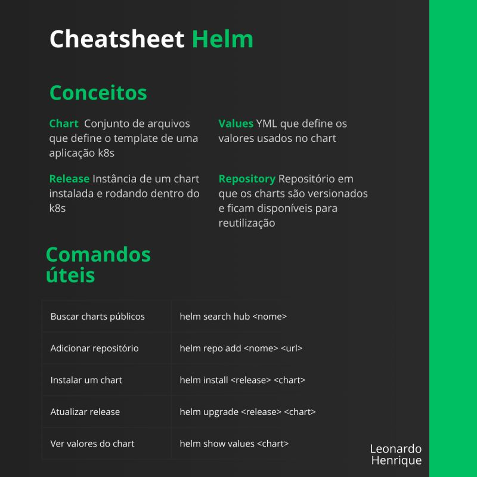

---
date:
  created: 2025-05-21
authors:
  - leonardo-henrique
categories:
  - Leonardo Henrique
comments: true
slug: in-helm
tags:
  - SRE
  - Tools
  - K8s
  - Helm
---

# Helm - Gerenciador de pacotes para Kibernetes (K8s)

O Helm é o gerenciador de pacotes para Kubernetes. Assim como o NPM/YARN/PNPM estão para o Javascript, o Helm está para o k8s.

<!-- more -->

Com ele você consegue 
1️⃣ Reutilizar templates de implantação de suas aplicações (porque escrever código duplicado cansa)
2️⃣ Fazer rollouts e rollbacks de aplicações de forma simplificada 
3️⃣ Instalar stacks inteiras com um único comando

O principal componente do Helm é o chart, é ele que descreve o template que sua aplicação vai utilizar. Nele, você consegue configurar valores dinâmicos, evitando-se a necessidade de deixá-los "hardcoded" e favorecendo a reusabilidade.

A maneira mais comum (e elegante) de passar esses valores é através do arquivo values.yaml.

Por exemplo, se eu quiser implantar 2 Grafanas com configurações diferentes, não preciso criar dois deployment.yaml distintos. Crio um único chart e passo os valores personalizados para cada instância via values.yaml..

Massa, né? 

Se você já trabalha com Kubernetes e ainda não deu uma chance ao Helm, recomendo fortemente. Vai facilitar (muito) sua vida!

*_texto original publicado em [linkedin.com](https://www.linkedin.com/posts/leonardohenrique1_organizando-a-casa-dos-seus-deploys-com-helm-activity-7330371659415158786-_YKu?utm_source=share&utm_medium=member_desktop&rcm=ACoAAA8mACgBW3pozo66eL_dSeG0qaYo8uLUdBE)*