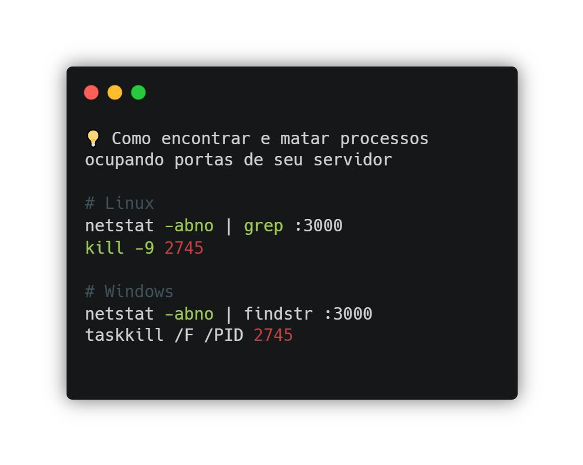

---
date:
  created: 2025-05-21
authors:
  - leonardo-henrique
categories:
  - Leonardo Henrique
comments: true
slug: in-kill
tags:
  - SRE
  - How-to
  - Command Line
---

# Dica rápida: como encontrar e matar processos ocupando portas de seu servidor

Já tentou rodar uma aplicação localmente e recebeu um erro de “port already in use”? Isso aconteceu comigo ao rodar uma aplicação Next.js em meu computador pessoal e percebi que o processo anterior ainda estava ativo, segurando a porta. 

Resolver essa situação é bem simples, basta localizar o processo que está ouvindo na porta específica e matá-lo.

<!-- more -->

## 1️⃣ Encontrando o processo

Linux: netstat -ano | grep :<PORTA>
Windows: netstat -abno | findstr :<PORTA>

Isso exibirá informações como o protocolo usado na conexão, endereços envolvidos e o mais importante, o ID do processo. Outra ferramenta que pode usar para esse fim é o lsof 😉 

## 2️⃣ Encerrando o processo

Linux: kill -9 <NUMERO_PID>
Windows: taskkill /F /PID <NUMERO_PID>

Aqui estamos passando uma instrução de encerramento que irá matar o processo com base no número de PID que encontramos no primeiro comando.

## Por que saber isso é importante?

Em uma situação real produtiva nem sempre você terá à disposição ferramentas de análise para identificar programas maliciosos ou indesejados que estejam em execução. Saber encontrá-los e encerrá-los é importante para impedir escalada de problemas e manter o ambiente funcional.

*_texto original publicado em [linkedin.com](https://www.linkedin.com/posts/leonardohenrique1_dica-r%C3%A1pida-como-encontrar-e-matar-processos-activity-7309570644227072000-t5uL?utm_source=share&utm_medium=member_desktop&rcm=ACoAAA8mACgBW3pozo66eL_dSeG0qaYo8uLUdBE)*