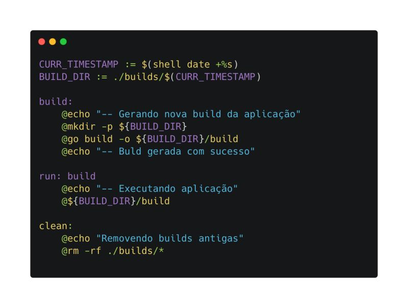

---
date:
  created: 2025-05-21
authors:
  - leonardo-henrique
categories:
  - Leonardo Henrique
comments: true
slug: in-make
tags:
  - SRE
  - How-to
  - Command Line
  - Make
---

# Como o Makefile pode te salvar?

Cansado/a de ficar repetindo os mesmos comandos enquanto desenvolve? Makefile pode te salvar!

Originalmente, ele foi criado para facilitar o processo de build de aplicações, evitando que você tenha que ficar repetindo comandos gigantes à exaustão.

<!-- more -->

Mas ele é versátil! Você pode encapsular qualquer tarefa repetitiva, desde rodar testes até gerar logs.

Basta criar um bloco que encapsule os comandos a serem executados e acionar com "make <nome_bloco>", Isso vai evitar perda de tempo com execuções manuais.

Além disso, você consegue executar instruções shell e configurar dependências entre seus blocos, garantindo-se que requisitos sejam satisfeitos antes da execução principal.

Olhe para a imagem abaixo, ao acionarmos o bloco "run" (make run), primeiro será executado o bloco "build", que é seu pré-requisito.

Para utilizar, crie um arquivo chamado Makefile (sem extensão). Caso não tenha a ferramenta instalada, basta instalá-la conforme seu sistema operacional.

Essa é uma excelente ferramenta para desenvolvedores e DevOps/SRE. 

*_texto original publicado em [linkedin.com](https://www.linkedin.com/posts/leonardohenrique1_cansadoa-de-ficar-repetindo-os-mesmos-comandos-activity-7313315861434400769-VMT5?utm_source=share&utm_medium=member_desktop&rcm=ACoAAA8mACgBW3pozo66eL_dSeG0qaYo8uLUdBE)*