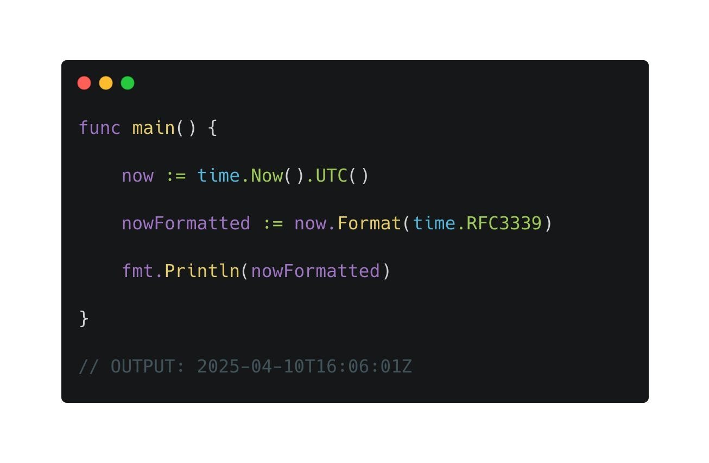

---
date:
  created: 2025-05-21
authors:
  - leonardo-henrique
categories:
  - Leonardo Henrique
comments: true
slug: in-rfc
tags:
  - SRE
  - Boas Práticas
---

# Você conhece o RFC 3339? Saiba como ele pode facilitar sua vida (e da sua equipe) quando estiverem lidando com datas!

Se existe algo que toda a equipe enfrenta, sem exceção, são problemas ou dificuldades na hora de se padronizar datas. 

Essa definição é importantíssima para evitar inconsistências, principalmente, em ambientes distribuídos e de microsserviços. 

<!-- more -->

## O que é o RFC 3339?

O RFC 3339 provém um formato bem definido para datas. Com ele você consegue representar com precisão a data e hora (inclusive informando o fuso horário correspondente).

### Formato básico
Ele segue esse formato: `2025-04-10T07:20:50.52Z`.

- Aquele **Z** ali no final significa que a data está em **UTC-0**.
- O **T** pode ser substituído por espaço. Também é uma opção válida.

### Exemplo com fuso horário
Se quiséssemos representar este horário no fuso brasileiro (UTC-3) informaríamos:  
`2025-04-10T04:20:50.52-03:00`.

## Boa prática
A dica é:  
🔹 Armazenar os dados em um timezone neutro como UTC-0 quando possível  
🔹 Permitir que as aplicações clientes realizem as conversões para o contexto delas

*_texto original publicado em [linkedin.com](https://www.linkedin.com/posts/leonardohenrique1_voc%C3%AA-conhece-o-rfc-3339-saiba-como-ele-pode-activity-7316130007917957120-2iw7?utm_source=share&utm_medium=member_desktop&rcm=ACoAAA8mACgBW3pozo66eL_dSeG0qaYo8uLUdBE)*