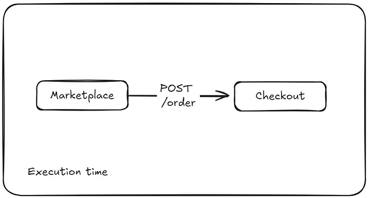
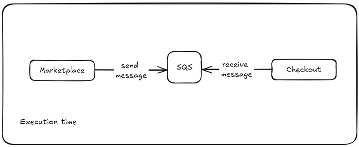

---
date:
  created: 2024-10-29
authors:
  - leonardo-henrique
categories:
  - Leonardo Henrique
comments: true
slug: md-sqs-p1
tags:
  - AWS
  - Guia Rápido
---

# Construindo aplicações confiáveis e resilientes com filas SQS — Parte 1

Quando estamos desenvolvendo software, existem aspectos com os quais devemos ter atenção para garantir o sucesso de nossas aplicações. Dentre estes aspectos, podemos citar a **resiliência**.

Em linhas gerais a **resiliência é o poder de recuperação de uma aplicação após situações adversas**.

Neste artigo gostaria de abordar um pouco sobre o uso do SQS para dar algumas ideias de como você pode utilizar esse serviço para desenvolver aplicações mais confiáveis e resilientes.

<!-- more -->

## O problema

Imaginemos um sistema simples de venda de produtos online. No processo de compra este sistema conta com dois serviços, um chamado **Marketplace** e o outro, **Checkout**. Quando uma nova venda é feita, o Marketplace envia uma requisição http para o Checkout com as informações necessárias para que ele prossiga com o fluxo. Observe o diagrama abaixo.

Tudo bem até aqui. Mas, e se por algum motivo, o Checkout apresentar problema e não estiver disponível quando o Marketplace enviar sua requisição? **Bem, aquela mensagem será perdida.** A depender do contexto em que você esteja, esse pode ser um cenário impensável e que pode trazer danos ao negócio.

“Ah, mas minha aplicação é muito bem feita! Não tem como acontecer isso, ela tem 100% de uptime mensal” — você pode estar pensando em secreto, mas, assim como disse Werner Vogels, CTO Amazon, “tudo falha, o tempo todo”. **Portanto, esteja preparado para imprevistos.**

## Possíveis soluções

Existem alguns modos de lidar com este cenário, porém todos eles vão tentar chegar no mesmo resultado: garantir que não percamos mensagens importantes em casos de indisponibilidade.

Para isso, devemos assumir que **nem sempre vamos conseguir processar as mensagens ao tempo em que são geradas** (parte de se trabalhar com tecnologia envolve abraçar a inevitabilidade de acontecimentos ruins haha). E isso pode acontecer por diversas razões, dentre as quais:

- O sistema pode estar sobrecarregado e por isso não consegue processar as mensagens dentro do tempo esperado
- O sistema pode estar simplesmente inoperante, ou seja, nenhuma mensagem vai sequer chegar nele
- A conexão entre os dois sistemas pode ter sofrido uma instabilidade e a mensagem nunca ter sido trafegada entre eles

Para isso, vamos adicionar uma “memória” intermediária à esses serviços. Ou seja, Markeplace não se comunicará mais diretamente com Checkout, e sim, enviará as mensagens para essa “memória”, eliminando-se a possibilidade de perder as mensagens quando o Checkout não estiver disponível para processá-las. E como estamos no mundo AWS é muito comum que esta “memória” seja uma fila SQS (Simple Queue Service).

Desta forma, nosso diagrama passaria a se parecer com isso:

## Como o SQS funciona?

O SQS é um sistema serveless de fila da AWS, o que significa que você não precisa se preocupar com infraestrutura, escalabilidade ou manutenções.

No nosso diagrama atualizado, teremos o seguinte workflow:

1. Quando o cliente efetua um novo pedido, O Marketplace enviará esta ordem para a fila SQS (e não mais para o Checkout)
2. A mensagem enviada se tornará disponível para ser consumida ao chegar na fila SQS
3. O Checkout pode estar com seu processamento no máximo e não consegue receber novas mensagens naquele momento. **Isso não é mais um problema**, porque assim que ele conseguir dar vazão à sua carga ele poderá resgatar as mensagens que estão disponíveis na fila.

Perceba que **desacoplamos** os dois serviços e adicionamos um maior nível de confiabilidade nesse processo já que mesmo que nosso Checkout saia do ar, ele consegue retornar e começar a processar as mensagens que não conseguiu. Isso, senhores(as), é **resiliência** na prática.

Recapitulando, o SQS funciona em modelo de enfileiramento, em que temos duas entidades importantes:

- Os produtores (producers), que geram o dado que será enviado para o SQS [send message]. No nosso caso, o Marketplace é o producer.
- Os consumidores (consumers), que leem as mensagens da fila SQS e as processam [receive message]— neste momento, os consumidores podem eliminar a mensagem da fila, dessa forma, não haverá processamentos posteriores duplicados. Em nosso exemplo é o Checkout que é o consumer.

Além disso, existem dois tipos de filas SQS. Apesar de que há várias algumas outras diferenças de ordem prática entre elas, lembre, por hora, que:

- Fila do tipo **standard** não preserva a ordem de recebimento das mensagens e **pode entregá-las mais de 1 vez**
- Fila do tipo **FIFO** (First-In, First-Out) garante a ordenação das mensagens conforme elas chegarem na fila **entregando-as exatamente 1 vez aos consumers**

Saber qual a característica de seu sistema te ajudará a saber qual o tipo de fila escolher. Mas saiba que em geral o Standard é o must-go até que haja um motivo que faça a FIFO ser realmente ideal.

## Próximos passos

Agora você já é capaz de identificar cenários em que a utilização de filas SQS pode ajudar a trazer mais confiabilidade a seus sistemas. No próximo artigo discutiremos conceitos mais avançados sobre uso de delas e algumas dicas de uso.

*_texto original publicado em [medium.com](https://medium.com/@leonardoh481/construindo-aplica%C3%A7%C3%B5es-confi%C3%A1veis-e-resilientes-com-filas-sqs-parte-1-74a76d4fd527)*