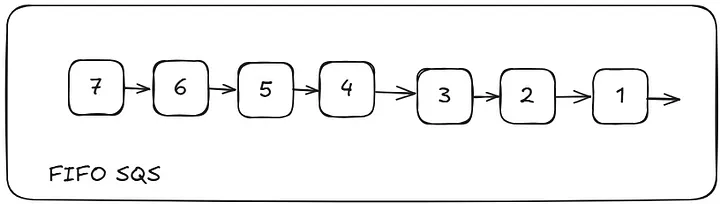

---
date:
  created: 2025-03-05
authors:
  - leonardo-henrique
categories:
  - Leonardo Henrique
comments: true
slug: md-sqs-p2
tags:
  - AWS
  - Guia Rápido
---
# Construindo aplicações confiáveis e resilientes com filas SQS — Parte 2

Em nossa última publicação, falamos sobre os conceitos básicos de SQS para que você consiga desacoplar seus fluxos, e assim, aumentar a confiabilidade de seus sistemas. Se você não acompanhou a Parte 1, basta clicar aqui.

Hoje trataremos sobre alguns tópicos mais avançados e que são essenciais na hora de você montar uma infraestrutura que esteja 100% alinhada com as suas necessidades (tanto técnicas quanto de negócio).

<!-- more -->

## Tipos de fila SQS

Há dois tipos de fila SQS e você deve conhecer bem ambas para decidir o que cabe melhor no seu caso de uso

### Standard (padrão)

  
*Funcionamento de uma Fila SQS Padrão*

A fila padrão SQS garante que as mensagens enviadas a ela serão entregues **ao menos uma vez** ao destino, ou seja, é possível que haja duplicatas. Outra característica é que há a possibilidade de entrega das mensagens fora da ordem que foram enviadas. A AWS tentará preservar a ordem (best-effort ordering) mas em muitos casos não será possível.

Na prática isso significa dizer que se você enviar 3 mensagens com os conteúdos [“olá”, “bom”, “dia”] para uma SQS padrão é possível que elas sejam disponibilizadas como [“dia”, “olá”, “bom”]. Ou seja, **você não pode confiar em ordenação em filas SQS padrão**.

Dessa forma, atente-se para dois pontos principais ao arquitetar suas soluções:

1. Idempotência: seu sistema deve ser capaz de lidar com mensagens duplicadas sem que um comportamento estranho seja iniciado
2. Seu sistema precisa saber lidar com mensagens desordenadas (ou você precisaria ordená-las de algumas forma)

Como esse tipo de fila SQS não se preocupa com ordenação das mensagens você é beneficiado com um altíssimo throughput (quase que ilimitado segundo a própria AWS). Além disso, você conta com uma latência baixíssima de cerca de < 10ms entre publicação e disponibilização de mensagens.

### FIFO (first-in, first-out)

  
*Funcionamento de uma fila SQS FIFO*

Diferente da fila SQS padrão, a fila SQS FIFO garante que suas mensagens sejam entregues na ordem que são enviadas. Ou seja, a primeira mensgem enviada, será a primeira mensagem a ser consumida.

Outro ponto importante, é que neste tipo de SQS você terá a entrega da mensagem apenas 1x, garantindo que não haja duplicatas.

Além disso, existe um requisito de nome para filas SQS FIFO: elas precisam ter o sufixo .fifo como em “minha-fila.fifo”.

Devido a essas garantias, a fia SQS FIFO possui algumas limitações de desempenho se comparada à fila padrão. Conseguimos enviar 300 msg/s discretas ou 3000 msg/s se utilizarmos batch.

Escolha esse tipo de fila quando a ordenação de mensagens/eventos for mais prioritário que performance, exemplo:

- Você precisa armazenar quais foram as seções visitadas dentro de seu site por um usuário para montar um user journey para a área de marketing
- Você precisa gerar múltiplas ordens de pagamento, cada ordem deve ser compensada seguindo uma sequência específica

## Visibility timeout

Outra funcionalidade interessante de filas SQS é o tempo limite de visibilidade (visibility timeout) que carinhosamente gosto de chamar de janela de visibilidade. Com ela você consegue configurar por quanto tempo uma mensagem ficará “invisível” para outros consumidores até que retorne para a fila por não-processamento.

Digamos que você tenha 3 consumidores para sua fila SQS e que o consumidor 1 inicia o processamento da Mensagem 1. A partir desse momento ele terá que finalizar seu processo e remover a Mensagem 1 da fila dentro do tempo definido em sua janela de visibilidade. Por padrão ela é de 30 segundos mas você pode ajustar. Durante esse período a mensagem se torna invisível para os demais consumidores. Se o tempo máximo se esgotar e a mensagem não tiver sido removida da fila SQS, ela se tornará disponível para processamento novamente.

É importante que você domine esse comportamento e conheça a natureza de suas soluções porque configurar uma janela de visibilidade muito alta fará com que suas mensagens demorem para ser reprocessadas; e de igual forma, se configurar uma janela muito pequena, seus consumidores podem não ter tempo hábil de processamento.

## Tratamento de erros com SQS

Um caso de uso bem interessante para filas SQS é a de utilizá-las como um “storage” temporário para eventos que por algum motivo não conseguiram ser processados no fluxo normal. A esse tipo de fila nominamos como “dead letter queue”. Com isso, você consegue configurar processos automatizados e baseados em eventos para que tratem estas mensagens com falha. Vale lembrar que a retenção máxima de filas SQS é de 14 dias, depois disso as mensagens são automaticamente removidas.

## Segurança

### Criptografia

- Client-side: caso necessite, criptografe as mensagens antes de enviá-las para o SQS. Você pode utilizar o próprio KMS da AWS ou outra chave customizada.
- In-flight: priorize utilizar as APIs da AWS no protocolo HTTPS. Assim você já eliminará alguns perigos iniciais de se utilizar HTTP.
- At rest: você consegue proteger as mensagens que estão dentro das filas SQS utilizando chaves KMS. Dessa forma, apenas consumidores que detenham as permissões corretas à chave conseguirão consumí-las.

### Políticas

Lembre-se de configurar somente as permissões necessárias para as aplicações/usuários que irão interagir com suas filas SQS.

---

Essa foi a parte 2 sobre a utilização de SQS nos seus fluxos. Espero que tenha gostado do conteúdo, se tiver algo a acrescentar fique à vontade para comentar, ficarei feliz em responder!

*_texto original publicado em [medium.com](https://medium.com/@leonardoh481/construindo-aplica%C3%A7%C3%B5es-confi%C3%A1veis-e-resilientes-com-filas-sqs-parte-2-1d75cd894676)*