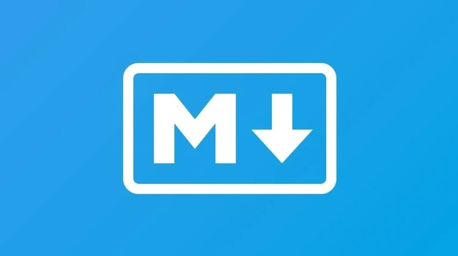

---
date:
  created: 2024-11-17
authors:
  - leonardo
categories:
  - Leonardo Pangaio
comments: true
slug: como-estudo-em-2024
tags:
  - Inspiração
  - História
  - How-to
  - Documentação
---

# Como estudo em 2024

Em resumo, tenho escrito todas as minhas anotações em [Markdown](https://www.markdownguide.org/). Faço isso pois além da escrita ser simples, não me preocupo muito pouco com a formatação do documento, e mais com o conteúdo. O Markdown é versátil, então se for necessário converter para HTML é simples, se eu for publicar usando o Github Pages também será fácil. E no documento eu consigo inserir imagens, links externos, diagramas, "mermaid", referências a outros documentos do mesmo repositório e etc...

<!-- more -->

Para editar os documentos, utilizo o [Microsoft Visual Studio Code (VSCode)](https://code.visualstudio.com/), pois além de ser útil com linguagens de programação e linguagens de marcação (portanto centralizo quase tudo na mesma ferramenta), também tenho plugins e configurações que venho fazendo com o passar do tempo para aumentar a produtividade, tanto no trabalho quanto nos estudos. Com relação aos estudos, ele me facilita quanto a edição do markdown (linter) quanto também me mostra um preview de como o documento está ficando.

Para armazenar/versionar as minhas anotações eu utilizo o [Git](https://git-scm.com/) + [Github](https://github.com/), pois além de serem serviços gratuitos, possuem uma versatilidade muito boa. Se eu precisar compartilhar somente um trecho de código, posso compartilhar um Gist do Github com alguém, se eu for estudar com outra pessoa, ou quiser compartilhar minhas anotações, posso adicionar ela como contribuidora, se eu quiser publicar o que estudei para a comunidade, posso deixar o repositório público ou ainda gerar um Github Pages.

Em relação a ferramentas adicionais, eu utilizo:
- Programa de print screen, como [Greenshot](https://getgreenshot.org/) ou [Lightshot](https://app.prntscr.com/pt-br/index.html) (Windows) ou o [Flameshot](https://flameshot.org/) (Linux) para agilizar nas capturas de tela com edições simples;
- Programa para diagramas, em geral uso muito o [Draw.io](https://www.drawio.com/) para diagramas genéricos, também utilizo o [Freemind](https://freemind.sourceforge.io/wiki/index.php/Main_Page) para mindmaps e o [Mermaid](https://mermaid.live) se eu for realizar alguma documentação de algum aplicativo. O interessante do mermaid é que ele tem integração nativa com a maioria dos visualizadores de markdown e repositórios como Github, Gitlab, Azure DevOps e outros e também com o Draw.io;

Com relação as fontes, em geral começo os meus estudos ou com alguma playlist do [Youtube](https://www.youtube.com/) ou curso da [Udemy](https://www.udemy.com/) e vou comparando com documentações oficiais (caso seja para alguma certificação, as únicas fontes anotadas são as oficiais) e outros forums e blogs como [w3schools](https://www.w3schools.com/), [MDN](https://developer.mozilla.org/en-US/), [GeeksForGeeks](https://www.geeksforgeeks.org/), [Stack Overflow](https://stackoverflow.com/) e outros. Para pesquisas mais aprofundadas, além da utilização do google e os sites que encontro também tenho utilizado MUITO o [chatGPT](https://chatgpt.com/), [Perplexity](https://www.perplexity.ai/) e [NotebookLM](https://notebooklm.google.com/).

A minha organização geralmente é a seguinte, após a escolha de um determinado assunto, eu crio um repositório no Github como privado, clono para o meu computador e começo com as anotações (readme.md), caso eu decida fazer uma listagem de coisas que eu ainda tenho que estudar, crio um documento chamado `todo.md` e vou adicionando lá os tópicos que eu sei que ainda estão pendentes, caso eu esteja fazendo um curso, eu crio um arquivo chamado `timeline.md` e lá vou adicionando os dias que eu estudei e uma observação de qual aula/vídeo/capítulo eu parei de estudar naquele dia, caso eu acabe tendo muitas referências, eu posso gerar um arquivo chamado `references.md` e lá vou criando títulos e sub-títulos para as minhas referências, vou adicionando alguns comentários ou descrições para cada referência, assim como seu link para acesso rápido depois, caso seja algo técnico/prático, em geral eu crio uma pasta chamada `Exemplos` e lá vou adicionando os exemplos (sempre comentados), e caso eu precise adicionar qualquer outro tipo de artefato, eu crio uma pasta chamada `Attachments` para adicionar os anexos, que podem ser documentos PDF (dentro de uma pasta chamada `PDF`), caso sejam imagens, prints, figuras, diagramas e etc... eu adiciono numa pasta chamadas `img` e por aí vai.

Uma coisa que tenho certeza que vai variar de pessoa pra pessoa, e que eu particularmente demorei MUITOS anos para aprender é que, cada pessoa observa e entende o mundo de formas diferentes, cada pessoa vai ter uma forma diferente de estudar, e portanto de anotar as coisas. Durante a minha escrita, eu procuro escrever para um Leonardo do futuro, para que ele, no futuro, quando precisar relembrar de algo que precise, seja de um código, uma explicação, uma consulta, um fluxo ou qualquer coisa, ele consiga entender o que o Leonardo do passado deixou anotado para ele. Isso pode ser um simples diagrama, pode ser uma anotação, pode ser um snippet de código, pode ser um link de um fórum que está descrito de forma que eu consiga entender, pode ser um print de tela, uma conversa com alguma IA generativa, uma conversa com um amigo que soube explicar, em resumo, qualquer coisa que me faça entender e lembrar do que eu estava procurando.