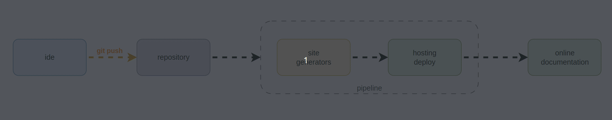

---
date:
  created: 2025-03-11
authors:
  - leonardo
categories:
  - Leonardo Pangaio
comments: true
slug: documentacao-como-codigo
tags:
  - Documentação
  - Inspiração
  - Apresentação
  - Guia Rápido
---

# Documentação como Código (DaC)

*Documentation as Code (DaC)* é uma abordagem que trata a documentação de software como parte integrante do desenvolvimento de código, utilizando as mesmas práticas e ferramentas aplicadas ao código-fonte. Em vez de manter a documentação separada em sistemas distintos, ela é escrita em formatos de texto, como [Markdown](https://www.markdownguide.org/), [reStructuredText](https://www.sphinx-doc.org/en/master/usage/restructuredtext/basics.html) ou [LaTeX](https://www.latex-project.org/), e armazenada em repositórios versionados. Essa prática permite que a documentação evolua junto com o software, garantindo que as informações estejam sempre atualizadas e alinhadas com as mudanças de implementação.

<!-- more -->

Essa é a definição de DaC mais comum de se encontrar por buscas no [Google](https://www.google.com/) ou utilização de alguma IA como [chatGPT](https://chatgpt.com/) e [Perplexity](https://www.perplexity.ai/), mas podemos extrapolar e resumir DaC como o próprio significado da sigla já diz, **Documentação como Código**. A diferença é que originalmente a DaC foi pensada para documentação de software, mas extrapolando, ela serve para qualquer tipo de documentação, seja para um site pessoal, para um blog, para documentar receitas de cozinha, para estudos, bases de conhecimento, artigos científicos ou qualquer outro tipo de documento que possamos querer criar, versionar, gerenciar, compartilhar, auditar ou organizar.

De forma minimalista, podemos dizer que DaC é tratar documentações como se fossem código, sendo versionadas, tendo uma linguagem de marcação, podendo ter um pipeline, um ambiente para desenvolvimento, teste e produção, escolhendo a IDE favorita e por aí vai.

## Vantagens da DaC

Documentar como código traz vantagens significativas, especialmente no que diz respeito ao versionamento. Ao manter a documentação em repositórios [Git](https://git-scm.com/), todas as alterações ficam registradas, permitindo a recuperação de versões anteriores e facilitando a identificação de quando e por que certas mudanças foram implementadas. Esse versionamento fornece um histórico completo, que pode ser auditado e utilizado para comparações entre diferentes versões, garantindo transparência e rastreabilidade ao longo do tempo.

Além disso, a abordagem de DaC promove a colaboração entre as equipes. Com o uso de sistemas de controle de versão, é possível que múltiplos colaboradores trabalhem simultaneamente na documentação, submetendo atualizações por meio de pull requests, que podem ser revisadas e aprovadas de forma colaborativa. A automação também desempenha um papel crucial, permitindo a integração com pipelines de CI/CD que geram, validam e publicam a documentação automaticamente. Essa automação reduz a sobrecarga manual, garantindo que a documentação esteja sempre sincronizada com as mudanças do código e melhorando a eficiência do processo de desenvolvimento.

Se pensarmos que nossa documentação fará parte de uma base de conhecimento, a DaC também traz os pontos principais, como segurança, revisão, versionamento, colaboração e organização dos artigos.

Comparando com outras formas de documentação, como sites escritos de forma manual (também podemos usar DaC com eles), documentos em Word, PDFs e outras formas, a documentação como código tem a vantagem de ser simples, o que facilita a atualização, mantendo a documentação válida e não depreciada. 

A formatação mais comum de se trabalhar com as documentações é o Markdown, este formato é muito utilizado por ser simples, interpretado pela maior parte dos repositórios de código, o que faz com que o foco seja o conteúdo e não muito o formato, portanto se torna mais simples utilizar este formato.

## Tipos/Formas de Documentações

Bom, já sabemos o que é DaC, suas vantagens e diferenças de outros tipos de documentação, agora vamos falar um pouco dos tipos de documentações que podemos ter, e para isto devemos pensar para quem será a documentação, e o que será documentado. Por exemplo, se fomos fazer a documentação de um software, podemos utilizar docstrings, comentários e um arquivo `readme.md` junto com o repositório, se formos realizar a documentação de um curso que estamos fazendo, vamos ter uma abordagem um pouco diferente, se formos documentar troubleshooting ou erros conhecidos, vamos ter outra abordagem, e por aí vai...

Aqui vou focar em alguns tipos de documentação:

- Documentação genérica;
- Documentação de código (manual e automática);
- Documentação de APIs;

E cada uma destas formas, ou tipos de documentações, vão ter abordagens diferentes, com tecnologias, utilizações e ferramentas levemente diferentes, mas em suma são bem parecidas.

Vale ressaltar que na grande maioria dos exemplos deste artigo, vou utilizar o formato Markdown, pois é o mais simples e é o que eu utilizo para escrever os próprios artigos, o reStructuredText até onde consegui pesquisar ele foi criado pelo time do Sphinx para a documentação que a aplicação realiza e o LaTeX foi criado para documentação acadêmica, e é extremamente completo e complexo, ele é pensado para documentações extensas que necessitam diagramações precisas (como artigos científicos por exemplo).

### Documentações Gerais

Aqui vamos estar falando de qualquer tipo de documentação, estudos, receitas, procedimentos operacionais padrão (POP), artigos para um time de suporte, FAQ de um determinado produto e etc...

Neste cenário, vamos ter o pensamento da criação do conteúdo, armazenamento do código e publicação do mesmo.

#### Criação do Conteúdo

Para criar o conteúdo de nossa documentação, podemos utilizar algumas ferramentas como editores de textos, IDEs e outras ferramentas como [Obsidian](https://obsidian.md/) para criar o conteúdo em Markdown e com alguma organização de anexos como imagens, vídeos e outros documentos que por ventura o autor queira compartilhar com seus leitores.

#### Armazenamento e Versionamento

Como esta documentação será armazenada em um repositório git ([Github](https://github.com/), [Gitlab](https://about.gitlab.com/), [Azure Devops](https://azure.microsoft.com/pt-br/products/devops), [Bitbucket](https://bitbucket.org/product/) e outros), ela já vai ser versionada, e também vai permitir o controle de quem poderá alterar a documentação, quem deverá ser o revisor, essa documentação terá rastreio de quem criou, de quando foi criada e quais as correções que foram tendo ao longo do tempo.

#### Publicação da Documentação

Este ponto é que difere muito dos outros tipos de documentação, pois é na forma de publicar/disponibilizar a documentação que algumas coisas são diferentes.

No caso de documentações genéricas, podemos utilizar a Wiki do Azure Devops, se estivermos criando uma documentação para equipes técnicas, ou podemos utilizar o Github Pages para publicar um site estático, se estivermos escrevendo um blog, ou ainda a própria visualização do arquivo `readme.md` que foi criada no repositório.

Se a opção for a criação de documentos para publicação externa, podemos utilizar ferramentas como Github Pages ou um [Bucket S3](https://aws.amazon.com/pt/s3/) da [AWS](https://aws.amazon.com/pt/) como hospedagem de nosso site e ferramentas como [MkDocs](https://www.mkdocs.org/), [Hugo](https://gohugo.io/), [Docusaurus](https://docusaurus.io/) e [Jekyll](https://jekyllrb.com/) para realizar a criação desse site para nós, onde elas convertem os nossos documentos escritos em markdown para html.

Nesse tópico ainda podemos ter mais dois pontos importantes, podemos utilizar uma Wiki pra poder renderizar as nossas documentações como por exemplo no Azure Devops, onde podemos ter uma wiki renderizando as documentações de um repositório, fazendo uma base de conhecimento pra uma equipa de suporte, QAs ou desenvolvedores. 

Ou podemos utilizar uma ferramenta de repositório e utilizando um pipeline podemos fazer a hospedagem em outro ambiente, como um Bucket S3 da AWS, ou [Locaweb](https://www.locaweb.com.br), ou [Hostinger](https://www.hostinger.com.br/), ou [HostGator](https://www.hostgator.com.br/) ou quaisquer outras plataformas de hospedagem.

Caso seja necessário a implementação de uma forma de autenticação/autorização, ainda podemos utilizar algo como um nginx, ou outro proxy reverso, para integrar com alguma forma de validação de credenciais.

#### Extras

Como estamos falando de documentação livre, podemos precisar de outras ferramentas para auxiliar na documentação, pois, por vezes texto, imagens e links podem não ser o suficiente, ou pelo menos, podemos melhorar a visualização para o usuário que vai ler esta documentação.

Para isto, deixo aqui alguns exemplos de "plugins" ou ferramentas externas que podem nos apoiar com relação a isto, tanto para diagramas quanto sobre outros que podem ser úteis:

- [Mermaid.js](https://www.mermaidchart.com/): Ferramenta para criação de diagramas como código, ela é reconhecida pela maior parte dos geradores de site estático, como MkDocs, Jekyll e outros;
- [KaTeX](https://katex.org/): Ferramenta que renderiza um código para uma expressão matemática;
- [Graphviz](https://graphviz.org/): Ferramenta específica para diagramas em grafos;
- [MathJax](https://www.mathjax.org/): Semelhante ao KaTeX, ele renderiza código em expressões matemáticas;
- [Diagrams](https://diagrams.mingrammer.com/): Biblioteca em Python para criação de diagramas como código;
- [GoDiagram](https://godiagram.com/): Biblioteca para .NET para geração de diagramas como código;
- [Plant UML](https://www.plantuml.com): Ferramenta para criação de diagramas UML como código;
- [LaTeX](https://www.latex-project.org/): Ferramenta para criação de documentos acadêmicos longos e complexos que exigem diagramação precisa;

!!! note
    
    Ferramentas que geram diagramas por meio de código também são chamadas de DaC, porém com o significado levemente diferente "DaC - Diagram as Code".

#### Exemplo

Este cenário é o que eu construí o meu site [pangaio.com.br](https://pangaio.com.br), onde os documentos são escritos em markdown e convertidos pelo [Material for MkDocs](https://squidfunk.github.io/mkdocs-material/) e hospedados pelo [Github Pages](https://pages.github.com/).

E como exemplo deste cenário, deixo aqui o [repositório](https://github.com/leonardopangaio/website) do meu site.

### Documentação de Código

Neste ponto vamos considerar que a documentação desejada é a documentação de código fonte de algum software, neste caso a abordagem muda um pouco, pois a documentação será junto com o software que está sendo desenvolvido (a utilização de IDEs fica a cargo do desenvolvedor) e a utilização de repositórios já é padrão pada códigos fontes.

O que muda neste tipo será a forma de escrita da documentação e quais as tecnologias que vamos utilizar para nos facilitar.

A documentação de código é dependente de cada linguagem, pois cada uma vai ter uma forma de gerar comentários e "docstrings" para explicar as classes e funções do código, e são com esses tipos de artefatos/informações é que podemos trabalhar.

Existem ferramentas que fazem o arquivo readme de forma automática, como o [readme-ai](https://github.com/eli64s/readme-ai), [readme.so](https://readme.so/), [LLMCode](https://github.com/javierganan99/LLMCode) dentre outros, que farão a análise do código e vão escrever um documento explicando o código. Uma referência que achei bem legal pra quem está perdido com a criação de seus arquivos `readme.md` de seus projetos é o [Make a README](https://www.makeareadme.com), ele tem o básico para que a pessoa comece a escrever seus próprios arquivos readme de forma organizada e também tem sugestão de uma infinidade de técnicas e ferramentas para auxiliar nessa tarefa.

Ainda sobre "docstrings", existem ferramentas que geram elas de forma automática, como por exemplo **[pyment](https://github.com/dadadel/pyment)** para Python, ou **[JSDoc](https://jsdoc.app/)** para Javascript e o **[javadoc](https://docs.oracle.com/javase/8/docs/technotes/tools/windows/javadoc.html)** para Java são alguns exemplos que geram a documentação, ou pelo menos um esboço dela, a partir da análise do código.

Também existem ferramentas que validam a qualidade da documentação interna do código, como o **[docstr-coverage](https://github.com/HunterMcGushion/docstr_coverage)** que ele verifica se as funções e/ou classes do código fonte em Python estão documentadas com "docstrings".

A partir dessa documentação existente no código, podemos ir para a próxima etapa da documentação, que é a conversão dessa documentação no código para um site mais legível e com visual mais agradável para a leitura e pesquisa. Neste ponto podemos utilizar ferramentas como **[Sphinx](https://www.sphinx-doc.org)** e **[Doxygen](https://www.doxygen.nl/)**, que vão buscar no código fonte todas as "docstrings" e gerar um site estático com essa documentação.

Nesse cenário aqui, já podemos começar a pensar em um pipeline para a geração da documentação de forma automática, onde usamos uma ferramenta para validar a qualidade da documentação, uma para gerar a documentação pendente de forma automática e uma para gerar um site estático e realizar o deploy em algum ambiente para hospedagem.

#### Exemplo

A grande diferença desse cenário para o anterior, é que a documentação está inserida no código fonte da aplicação, e não mais em um arquivo separado.

Contudo o pipeline segue o mesmo, sendo repetitivo, mudando apenas o tipo de arquivo de entrada.

Para este cenário, criei esse [repositório](https://github.com/leonardopangaio/Sphinx_Test) como exemplo.

### Documentação de API

Aqui temos a base semelhante aos outros dois tipos, onde a documentação é gerada como se fosse código, armazenado em um repositório git, onde será versionado e por aí vai.

O que difere aqui, é que na documentação de API, teremos a possibilidade de escolha de formato, onde a mais comum e aceita é a OpenAPI, que em resumo é uma especificação padronizada de como se criar a documentação para APIs REST.

A partir da criação dessa documentação podemos utilizar ferramentas como Swagger ou ReDoc para gerar um site onde o usuário pode navegar e buscar as informações desejadas.

#### Exemplo

Este cenário segue parecido com os dois anteriores, porém, a diferença é que o resultado, geralmente, não é mais um site estático, pois em sua grande maioria, passa a realizar requisições além de simples GET.

Para este último cenário, criei esse [repositório](https://github.com/leonardopangaio/OpenAPI_Test) como exemplo.

## Desafio

O grande desafio na adoção de DaC, seja para qualquer uma das finalidades é a adoção cultural dela, seja para os desenvolvedores melhorarem as documentações internas ou externas, seja para a equipe de suporte aumentar a base de conhecimento de erros conhecidos, seja para o time de QA aumentar a relação de casos de testes ou quais quer outro tipo de documentação, o mais importante é a equipe responsável pela manutenção da documentação efetivamente administrar ela.

Por mais que a ideia de se trabalhar com a documentação como se fosse código seja a simplicidade, rastreio e cooperação, de nada adianta se os times efetivamente não trabalharem em cima das documentações (criando, atualizando e consumindo).

## Referências

**Documentation as Code (DaC)**

- [Beginner’s Guide to Documentation as Code](https://dev.to/giladmaayan/beginners-guide-to-documentation-as-code-11o1)
- [Docs as Code](https://www.writethedocs.org/guide/docs-as-code/)
- [Documentation as code: Principles, workflow, and challenges](https://www.tabnine.com/blog/documentation-as-code-principles-workflow-and-challenges/)

**OpenAPI**

- [Wikipedia sobre OpenAPI](https://en.wikipedia.org/wiki/OpenAPI_Specification)
- [Especificação da OpenAPI](https://spec.openapis.org/oas/v3.1.0)
- [OpenAPI - O que é?](https://www.openapis.org/what-is-openapi)
- [Swagger sobre OpenAPI](https://swagger.io/specification/)

**Diagram as Code**

- [Top 6 Tools to Turn Code into Beautiful Diagrams](https://youtu.be/jCd6XfWLZsg?si=tW8Ol4cIyo5TcHg4)
- [Top 7 diagrams as code tools for software architecture](https://icepanel.medium.com/top-7-diagrams-as-code-tools-for-software-architecture-1a9dd0df1815)
- [Diagram as Code](https://blog.bytebytego.com/p/diagram-as-code)
- [What is diagram as code?](https://docs.eraser.io/docs/diagram-as-code)

**Wikipedia**

- [Wikipedia sobre TeX](https://pt.wikipedia.org/wiki/TeX)
- [Wikipedia sobre LaTeX](https://pt.wikipedia.org/wiki/LaTeX)
- [Wikipedia sobre Markdown](https://pt.wikipedia.org/wiki/Markdown)
- [Wikipedia sobre ReStructuredText](https://pt.wikipedia.org/wiki/ReStructuredText)
- [Wikipedia sobre KaTeX](https://en.wikipedia.org/wiki/KaTeX)
- [Wikipedia sobre MathJax](https://en.wikipedia.org/wiki/MathJax)
- [Wikipedia sobre JSDoc](https://en.wikipedia.org/wiki/JSDoc)
- [Wikipedia sobre Javadoc](https://en.wikipedia.org/wiki/Javadoc)
- [Wikipedia sobre Doxygen](https://en.wikipedia.org/wiki/Doxygen)
