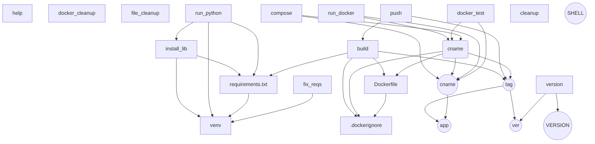

---
date:
  created: 2025-02-18
authors:
  - leonardo
categories:
  - Leonardo Pangaio
comments: true
slug: make-e-makefile
tags:
  - Apresentação
  - Guia Rápido
  - Automação
  - Documentação
  - Make
---

# Utilização do Make/Makefile para simplificar tarefas repetitivas

Se você já precisou compilar um programa, docker build, organizar comandos repetitivos ou automatizar tarefas dentro de um projeto, talvez tenha se deparado com o termo Makefile. Mas afinal, o que é isso e como ele pode facilitar a vida de quem trabalha com tecnologia?

<!-- more -->

## O que é o GNU make?

O `make` é uma ferramenta que ajuda a automatizar tarefas no desenvolvimento de software. Ele é amplamente usado para compilar programas, mas também pode ser utilizado para outras tarefas repetitivas, como rodar testes, gerar documentação ou até implantar aplicações.

Atualmente ele é mantido pela *GNU Project - Free Software Foundation*.

{ width="300" }

Ele funciona baseado em regras definidas em um arquivo chamado `Makefile` (da pasta corrente), que especifica quais ações devem ser executadas e em qual ordem.

O `Makefile` muitas vezes é considerado o `readme.md` do builder, pois além de simplificar tarefas repetitivas, ele também deixa documentado todos os passos que são feitos para realizar o build/compilação da aplicação.


> GNU Make é uma ferramenta que controla a geração de executáveis ​​e outros arquivos não-fonte de um programa a partir dos arquivos-fonte do programa.
> 
> O Make obtém seu conhecimento de como construir seu programa a partir de um arquivo chamado makefile, que lista cada um dos arquivos não-fonte e como computá-lo a partir de outros arquivos. Quando você escreve um programa, você deve escrever um makefile para ele, para que seja possível usar o Make para construir e instalar o programa.

*_referência direta do [site oficial](https://www.gnu.org/software/make/)*

## O que é um Makefile?

O `Makefile` é um arquivo de texto que contém regras organizadas em um formato específico. Essas regras informam ao `make` quais arquivos precisam ser atualizados e quais comandos devem ser executados.

O `make` identifica sempre o arquivo `Makefile` que estiver na pasta corrente, portanto, podemos ter mais de um arquivo `Makefile` em nosso projeto, e o arquivo que será interpretado pelo `make` será o da pasta corrente.

A estrutura básica de um `Makefile` segue este formato:

```makefile title="Makefile"
ALVO: DEPENDÊNCIAS
	RECEITA
	...
	...
# COMENTÁRIO
```

Onde:

- **Alvo:** O que será gerado ou atualizado.
- **Dependências:** Arquivos necessários para gerar o alvo, ou outros alvos dentro do mesmo arquivo `makefile`.
- **Receita:** A ação a ser executada (importante: deve ser indentado com um tab e não espaços).
- **Comentários:** São quaisquer textos explicativos ou para desativar um trecho do código. Eles são feitos com o caractere `#` no início da sentença de comentário.

Por exemplo:

```makefile title="Makefile"
# Alvo padrão do make.
all:  mensagem1
	echo "Olá mundo! Eu sou a receita geral do `makefile` desta pasta"

mensagem1:
	echo "Olá, eu sou a mensagem 1."
```

Neste exemplo de arquivo `Makefile` temos dois alvos, um geral, que é interpretado pelo comando `make` se não passarmos nenhum alvo, que é o alvo `all`, e o outro é o alvo `mensagem1`, que é uma dependência do *target* `all`.

Se executarmos o comando `make` sozinho, ele nos retornará o comando do alvo `mensagem1` e depois a sua saída e então retornará o comando do alvo `all` e sua saída.

```sh
echo "Olá, eu sou a mensagem 1."
Olá, eu sou a mensagem 1.
echo "Olá mundo! Eu sou a receita geral do makefile desta pasta"
Olá mundo! Eu sou a receita geral do makefile desta pasta
```

Nos comandos, também podemos ter um operador para ocultar que o `make` imprima o comando e depois sua saída, deixando apenas a saída do comando aparecendo. Este operador é o `@` antes do comando.

Voltando ao nosso exemplo, ficaria assim:

```makefile title="Makefile"
all:  mensagem1
	@echo "Olá mundo! Eu sou a receita geral do makefile desta pasta"

mensagem1:
	@echo "Olá, eu sou a mensagem 1."
```

E sua saída agora seria esta:

```sh
Olá, eu sou a mensagem 1.
Olá mundo! Eu sou a receita geral do makefile desta pasta
```

Ainda sobre Alvos, o `make`, por padrão, trata os alvos como arquivos. Portanto quando executamos `make <alvo>`, ele verifica se o arquivo correspondente ao alvo existe e compara sua data de modificação com as das suas dependências.

1. **Se o arquivo do alvo não existir:** O `make` executa os comandos da regra para criá-lo.
2. **Se o arquivo do alvo existir, mas suas dependências foram modificadas depois:** O `make` considera que o alvo está desatualizado e executa os comandos da regra para atualizá-lo.
3. **Se o arquivo do alvo já existir e for mais novo que suas dependências:** O `make` assume que ele já está atualizado e não executa os comandos. 

Exemplo:

```makefile title="Makefile"
saida.txt: entrada.txt
	echo "Processando entrada.txt..." > saida.txt
```

Se `entrada.txt` for modificado depois de `saida.txt`, o `make` irá rodar o comando para atualizar `saida.txt`.  

Se `saida.txt` for mais recente que `entrada.txt`, o `make` dirá:

```sh 
make: 'saida.txt' está atualizado.
```

Ou seja, o `make` não executa a regra se o arquivo do alvo já estiver atualizado.

Caso seja necessário definir alvos que **não são arquivos**, como comandos auxiliares (`clean`, `test`, `deploy`, etc.). Podemos usar o `.PHONY`, que informa ao `make` que o alvo **não representa um arquivo**, mas sim um comando a ser sempre executado.

Por exemplo:

```makefile title="Makefile"
.PHONY help

help:
	@echo "Mensagem de ajuda"
```

Neste exemplo, caso haja um arquivo chamado help dentro da pasta, o `make` entenderá que é um comando e vai executar o mesmo.

## Terminais

O `make` gera um terminal para cada comando executado, isso significa que um terminal vai ser criado, o comando executado e o terminal será encerrado, no próximo comando, um novo terminal será aberto e assim por diante.

Isso afeta como os comandos devem ser escritos, pois caso os comandos não sejam concatenados por `;` ou `&&`, e cada comando seja executado em terminais diferentes, podem não ter o funcionamento desejado. Por exemplo:

```makefile title="Makefile"
comandosJuntos:
	VAR="olá mundo" \
	&& echo $${VAR}

comandosSeparados:
	VAR="olá mundo"
	echo $${VAR}
```

A saída desses comandos serial algo parecido com isto:

```sh
make comandosJuntos
VAR="Variável do target comandosJuntos" \
 	&& echo ${VAR}
Variável do target comandosJuntos
```

```sh
make comandosSeparados
VAR="Variável do target comandosSeparados"
echo ${VAR}


```

No caso do alvo `comandosSeparados` como a variável foi declarada em um terminal e o comando `echo` foi executado em outro terminal, neste segundo a variável não tinha sido criada.

O `make` também nos permite informar que interpretador desejamos utilizar. Por padrão ele utiliza o `shell`, contudo podemos alterar o interpretador desejado utilizando a variável `SHELL`. Por exemplo:

```makefile title="Makefile"
SHELL := /bin/bash
```

Desta forma, o `make` irá utilizar o `bash` como interpretador invés de utilizar o `shell`.

Um caso prático da necessidade desta mudança é, por exemplo, quando trabalhamos com os ambientes virtuais do python (venv). Se criarmos um alvo para iniciar o *virtual environment* com o comando `source`, ele não será interpretado pelo `shell`, mas sim pelo `bash`.

## Variáveis

O `makefile` permite a utilização de variáveis em sua estrutura, não somente nas receitas, mas também nos alvos e dependências. Vale informar também, que o `make` considera as variáveis como string, portanto não será necessário inserir as `""` para declarar string. 

Para isto, basta declararmos a variável e atribuir um valor a ela, desta forma:

```makefile title="Makefile"
VARIAVEL=VALOR
var1 = VALOR

testeVariavel:
	@echo "A variável é $(VARIAVEL)" \
	&& echo "E a variável chamada var1 é $(var1)."
```

E a saída será esta:

```sh
make testeVariavel 
A variável é VALOR E a variável chamada var1 é VALOR.
```

As variáveis podem ser utilizadas tanto nos alvos, dependências e receitas, e caso sejam usadas como pré-requisitos, a ordem será da esquerda para a direita.

Também podemos trabalhar com variáveis com a passagem de parâmetros quando utilizamos o `make`.

Por exemplo, podemos ter um alvo, que sua receita utilize alguma estrutura de condicional, e que deve ter o valor passado durante sua chamada para a tomada de decisão. Para este caso, podemos utilizar a passagem de parâmetros do `make` para definir o valor de uma variável dentro da receita.

```makefile title="Makefile"
testeParametro:
	@echo "A variável vparam é igual a '$(vparam)'"
```

```sh
make testeParametro vparam="olá"
A variável vparam é igual a 'olá'
```

!!! note

    A utilização de variáveis (declaração e utilização) é bem parecido com shell script, a diferença é que invés de utilizar `${}`, no `makefile` devemos utilizar `$()`.

!!! note

    Para realizar a expansão de variáveis do terminal, será necessário a utilização de `$$` invés do cifrão simples.

!!! tip

    As variáveis podem ser declaradas com espaço ou sem.

!!! warning

    Quando declaramos uma variável, para o `make` é todo o valor da linha, portanto se tentarmos inserir comentário em linha, ele será considerado como parte da variável.

## Variáveis Automáticas 

> Suponha que você esteja escrevendo uma regra de padrão para compilar um arquivo ‘.c’ em um arquivo ‘.o’: como você escreve o comando ‘cc’ para que ele opere no nome do arquivo de origem correto? Você não pode escrever o nome na receita, porque o nome é diferente cada vez que a regra implícita é aplicada.
> 
> O que você faz é usar um recurso especial do make, as variáveis ​​automáticas. Essas variáveis ​​têm valores computados novamente para cada regra que é executada, com base no alvo e nos pré-requisitos da regra. Neste exemplo, você usaria ‘$@’ para o nome do arquivo de objeto e ‘$<’ para o nome do arquivo de origem.
> 
> É muito importante que você reconheça o escopo limitado no qual os valores de variáveis ​​automáticas estão disponíveis: eles só têm valores dentro da receita. Em particular, você não pode usá-los em nenhum lugar dentro da lista de alvos de uma regra; eles não têm valor lá e se expandirão para a string vazia. Além disso, eles não podem ser acessados ​​diretamente dentro da lista de pré-requisitos de uma regra. Um erro comum é tentar usar $@ dentro da lista de pré-requisitos; isso não funcionará. Entretanto, há um recurso especial do GNU make, expansão secundária (veja [Expansão Secundária](https://www.gnu.org/software/make/manual/make.html#Secondary-Expansion)), que permitirá que valores de variáveis ​​automáticas sejam usados ​​em listas de pré-requisitos.

Podemos, dentro do `makefile`, utilizar um recurso chamado variáveis automáticas. Elas são variáveis que fazem referência automaticamente a partes já declaradas no `makefile`, compo por exemplo referenciar o próprio alvo, ou a primeira dependência.

Neste tópico pretendo dar alguns exemplos mais simples e deixar uma tabela de referência rápida. Caso este assunto lhe seja útil, sugiro dar uma lida na documentação oficial do **GNU Make** sobre [variáveis automáticas](https://www.gnu.org/software/make/manual/make.html#Automatic-Variables).

| Variável | Descrição |
| -------- | --------- |
| $@ | O nome do alvo |
| @< | Nome da primeira dependência |
| $? | Os nomes de todas as dependências que são mais novas que o alvo, com espaços entre elas |


## Wildcards

Durante a utilização de wildcards temos dois para representar "qualquer coisa", um para as receitas, que será o `*` e um para os alvos e dependências, que será o `%`.

A utilização de caracteres curingas ou wildcards é válida para aumentar a abstração das regras que criamos.

Por exemplo, caso seja desejado realizar uma determinada tarefa a para todos os arquivos `.o` de uma pasta, podemos criar um alvo chamado `%.o` e ele será aplicado para todas as dependências que sejam da extensão `.o`.

> A expansão de *wildcard* é realizada pelo make automaticamente em alvos e em pré-requisitos. Em receitas, o shell é responsável pela expansão do *wildcard*.

Os wildcards (ou caracteres curingas) aceitos pelo `make` são:

| Caractere | Descrição |
| --------- | --------- |
| `*` | Corresponde a qualquer sequência de caracteres (exceto /) |
| `?` | Corresponde a qualquer único caractere (exceto /) |
| `[]` | Corresponde a um conjunto ou intervalo de caracteres |

Existe também uma função, que veremos algumas mais pra frente, que é para explicitamente forçar a utilização de wildcard, por exemplo, em variáveis.

Por exemplo:

```makefile title="Makefile"
# Todos os arquivos .yml da pasta src
SRC = $(wildcard ./src/*.yml)
```

Neste exemplo, a variável vai ter uma lista com todos os arquivos `.yml` que estão contidas na pasta `./src`.

## Condicionais (IF)

O `make` tem duas formas de trabalhar com condicionais. A primeira delas e a mais simples é com a estrutura `if/else` nas receitas.

A sintaxe padrão de condicionais do `makefile` podem ser destas 3 formas:

```
condição
	ação caso condição verdadeira
endif
```

```
condição
	ação caso condição verdadeira
else
	ação caso condição falsas
endif
```

```
condição 1
	ação caso condição 1 verdadeira
else condição 2
	ação caso condição 2 verdadeira
else
	caso condições falsas
endif
```

Com esta sintaxe podemos realizar 4 tipos de testes:

- Se valor1 igual valor2;

```makefile title="Makefile"
ifeq (arg1, arg2)
ifeq 'arg1' 'arg2'
ifeq "arg1" "arg2"
ifeq "arg1" 'arg2'
ifeq 'arg1' "arg2"
```
Este teste, o `make` expande as variáveis e compara elas, em caso de serem idênticas, a ação de verdade será executada, caso não sejam, a ação de falso será executado, caso haja.

Um alerta importante é com relação a comparação de variáveis complexas, pois durante as expansões caracteres especiais ou espaços podem ser interpretados como espaços vazios, e isso fará com que a comparação não ocorra da melhor forma. Neste caso é sugerido a utilização de alguma função de manipulação de texto, como a função `$(strip)`.

- Se valor1 diferente valor2;

```makefile title="Makefile"
ifneq (arg1, arg2)
ifneq 'arg1' 'arg2'
ifneq "arg1" "arg2"
ifneq "arg1" 'arg2'
ifneq 'arg1' "arg2"
```

Este teste expande as variáveis e compara elas, caso sejam diferentes, a ação de condição verdadeira será executada, caso sejam iguais, a ação de falso será executada, caso exista.

- Se valor foi definido;

```makefile title="Makefile"
ifdef variable-name
```

O teste `ifdef` utiliza a variável como argumento, e não como uma referência. Se o valor da variável tiver um valor não vazio, a ação de condição verdadeira será executada, caso não haja valor, a ação de condição falsa será executada, caso haja.

Variáveis que nunca foram definidas, tem um valor vazio. Observe que este teste verifica apenas se a variável tem um valor, ele não realiza a expansão dela.

- Se valor não foi definido;

```makefile title="Makefile"
ifndef variable-name
```

Neste teste, é verificado se a variável tem valor vazio, caso tenha, a ação de condição verdadeira será executada, caso não, a ação de condição falsa será executada, caso haja.

As regras de expansão deste teste são iguais ao teste `ifdef`.

A segunda, são algumas funções de condicionais: `if`, `or`, `and` e `intcmp`.

Como são funções mais avançadas, e pessoalmente nunca cheguei a precisar delas, deixo aqui a referência da [documentação oficial](https://www.gnu.org/software/make/manual/make.html#Conditional-Functions) sobre elas.

## Funções nativas

O `make` tem internamente algumas funções que são aceitas nos arquivos `makefile`.

As funções permitem que o texto seja processado pelo `makefile` para computar arquivos e operar neles ou utilizar os comandos nas receitas. Podemos usar uma função, onde damos um nome para a função e passamos seus argumentos para que ela funcione. O resultado do processamento da função é substituído, no `makefile`, no lugar da chamada da função, assim como as variáveis são substituídas.

Por exemplo:

```makefile title="Makefile"
# Todos os arquivos .yml da pasta src
SRC = $(wildcard ./src/*.yml)

# Trocar a extensão .yml por .json
OBJ = $(SRC:.yml=.json)
```

Aqui, novamente, eu vou recomendar a leitura da [documentação oficial](https://www.gnu.org/software/make/manual/make.html#Functions), pois são páginas e mais páginas de funções nativas, suas descrições, utilizações, exemplos e etc.

Vou deixar uma pequena lista de funções, que acredito que sejam as mais utilizadas.

| Tipo | Função/Sintaxe | Descrição |
| ---- | -------------- | --------- |
| wildcard | `$(wildcard *.txt)` | Informa que será passado um wildcard |
| file name | `$(addprefix <prefixo>, <arquivos/variáveis>)` | Adiciona um prefixo ao nome dos arquivos |
| file name | `$(addsuffix <sufixo>, <arquivos/variáveis>)` | Adiciona um sufixo ao nome dos arquivos |
| file name | `$(<variável>:<valor_inicial>=<valor_novo>)` | Substitui um trecho do nome do arquivo |
| file name | `$(dir <arquivo>)` | Extrai o valor do caminho do arquivo e não o seu nome |
| file name | `$(notdir <arquivo>)` | Extrai o nome do arquivo, desprezando o path do mesmo |
| shell | `$(shell <comando> <arquivo>)` | Realiza a expansão do comando, executa o comando e captura sua saída |
| call | `$(call var,param1,param2,...)` | Realiza a expansão dos parâmetros e envia para a variável (que pode ser uma função personalizada) |
| foreach | `$(foreach var,list, expression)` | Realiza um laço de repetição que aplica uma operação a cada item de uma lista |
| file | `$(file operation, file, content)` | Realiza a criação, escrita, adição ou leitura de um arquivo |

## Funções personalizadas

O `make` também nos permite a criação de funções personalizadas. Para explicar um pouco da sintaxe, deixarei um exemplo:

```makefile title="Makefile"
define FUNCAO
	@echo "Olá, o parâmetro 1 é $(1) e o parâmetro 2 é $(2)"
endef

Alvo:
	$(call FUNCAO,"pParam1","pParam2")
```

Desta forma, quando o `Alvo` for chamado/executado, ele vai executar a `FUNCAO` passando os dois parâmetros definidos.

```sh
make Alvo
Olá, o parâmetro 1 é pParam1 e o parâmetro 2 é pParam2
```

!!! note

	Ao realizar a chamada da função, podemos também passar variáveis já definidas, variáveis que serão recebidas como parâmetros e variáveis manipuladas por outras funções nativas do `make`.

## Exemplo de makefile

Deixo aqui o `makefile` que utilizo para alguns scripts python que utilizo no dia-a-dia.

```makefile title="Makefile"
# Versão do Makefile
VERSION="2.7.6"
# Versão da aplicação
ver="v1.0.0a"
SHELL := /bin/bash
# Pega o nome do diretório atual e converte pra lower case
app=$(shell echo $(notdir $(shell pwd)) | tr '[:upper:]' '[:lower:]')
tag="registryserver:8080/path/$(app)-$(ver):latest"
cname="docker-compose.$(app).yml"

.PHONY: help .dockerignore $(cname) install_lib fix_reqs build push run_python run_docker docker_test docker_cleanup file_cleanup compose

help: ## Mostra essa ajuda/descrição
	@grep -E '^[.a-zA-Z_-]+:.*?## .*$$' $(MAKEFILE_LIST) | sort | awk 'BEGIN {FS = ":.*?## "}; {printf "\033[36m%-30s\033[0m %s\n", $$1, $$2}'

version: ## Mostra a versão do arquivo makefile
	@echo "A versão do Makefile é: $(VERSION)"
	@echo "A versão da aplicação é: $(ver)"

venv: ## Criação de ambiente virtual para Python
	@python3 -m venv venv

install_lib: venv requirements.txt ## Instalação das dependências
	@source venv/bin/activate \
		&& pip3 install --upgrade pip \
		&& pip3 install --trusted-host pypi.org --trusted-host files.pythonhosted.org --no-cache-dir -r requirements.txt

run_python: venv requirements.txt install_lib ## Testa execução do script Python
	@source venv/bin/activate && python3 main.py

run_docker: $(cname) ## Testa execução via container docker
	@sudo docker compose -f $(cname) run --rm $(app)

requirements.txt: venv ## Gera o arquivo requirements.txt com as dependências
	@if [ ! -f requirements.txt ]; then \
			source venv/bin/activate \
			&& pip3 install pipreqs \
			&& pipreqs .; \
	fi

fix_reqs: venv ## Gera o requirements.txt baseado no que está instalado no venv
	@source venv/bin/activate \
		&& pip3 freeze > requirements.txt 

build: requirements.txt Dockerfile .dockerignore ## Build simples da imagem localmente
	@sudo docker build --no-cache -t $(app) .

push: build ## Upload para o registry
	@sudo docker tag $(app) $(tag) \
		&& sudo docker --debug push $(tag) \
		&& echo "$$(date +"%Y-%m-%d %H:%M:%S") - The last tag pushed was $(tag) and was made by $$USER" >> last_push.log 2>&1

docker_test: $(cname) ## Conjunto de comandos para teste de um container stand alone
	@sudo docker compose down -v; \
		sudo docker compose -f $(cname) up --build -d; \
		sudo docker compose logs -f --tail 100 $(app);

docker_cleanup: ## Limpeza TOTAL Docker
	@sudo docker ps -q | xargs -r sudo docker stop; \
		sudo docker system prune -af --volumes

file_cleanup: ## Limpeza dos arquivos temporários
	@sudo rm -rf ./__pycache__/ ./logs/ ./data/ .dockerignore Dockerfile $(cname)

$(cname): ## Criação do arquivo $(cname)
	@if [ ! -f $(cname) ]; then \
		echo "networks:" > $(cname); \
		echo "  internal:" >> $(cname); \
		echo "    driver: bridge" >> $(cname); \
		echo "" >> $(cname); \
		echo "services:" >> $(cname); \
		echo "  $(app):" >> $(cname); \
		echo "    # build: ." >> $(cname); \
		echo "    image: $(tag)" >> $(cname); \
		echo "    stdin_open: true" >> $(cname); \
		echo "    tty: true" >> $(cname); \
		echo "    environment:" >> $(cname); \
		echo "      TZ: America/Sao_Paulo" >> $(cname); \
		echo "      FORCE_COLOR: true" >> $(cname); \
		echo "    volumes:" >> $(cname); \
		echo "      - ./logs/:/app/logs" >> $(cname); \
		echo "      - ./data/:/app/data" >> $(cname); \
		echo "    networks:" >> $(cname); \
		echo "      - internal" >> $(cname); \
	else \
		sed -i "s|^\(\s*image:\s*\).*|\1$(tag)|" $(cname); \
	fi

Dockerfile: .dockerignore ## Criação do arquivo Dockerfile
	@if [ ! -f Dockerfile ]; then \
		echo "FROM python:3.12-slim" > Dockerfile; \
		echo "" >> Dockerfile; \
		echo "RUN mkdir /app" >> Dockerfile; \
		echo "WORKDIR /app" >> Dockerfile; \
		echo "" >> Dockerfile; \
		echo "# Instalar dependências do sistema necessárias" >> Dockerfile; \
		echo "RUN apt-get update && apt-get install -y freetds-dev libsybdb5 build-essential gcc" >> Dockerfile; \
		echo "RUN apt-get clean && rm -rf /var/lib/apt/lists/*" >> Dockerfile; \
		echo "" >> Dockerfile; \
		echo "# Instalar dependências python necessárias" >> Dockerfile; \
		echo "COPY requirements.txt ./" >> Dockerfile; \
		echo "RUN pip install --upgrade pip" >> Dockerfile; \
		echo "RUN pip install --trusted-host pypi.org --trusted-host files.pythonhosted.org --no-cache-dir -r requirements.txt" >> Dockerfile; \
		echo "" >> Dockerfile; \
		echo "COPY . ." >> Dockerfile; \
		echo "" >> Dockerfile; \
		echo 'CMD [ "python", "./main.py" ]' >> Dockerfile; \
	fi

.dockerignore: ## Criação do arquivo .dockerignore
	@echo "# Folders to be ignored" > .dockerignore; \
		echo "__pycache__/" >> .dockerignore; \
		echo "venv/" >> .dockerignore; \
		echo "logs/" >> .dockerignore; \
		echo "data/" >> .dockerignore; \
		echo "old/" >> .dockerignore; \
		echo "tests/" >> .dockerignore; \
		echo "" >> .dockerignore; \
		echo "# Files to be ignored" >> .dockerignore; \
		echo ".env" >> .dockerignore; \
		echo "*.md" >> .dockerignore; \
		echo "makefile" >> .dockerignore; \
		echo "*.log" >> .dockerignore; \
		echo "*.yml" >> .dockerignore; \
		echo "*.yaml" >> .dockerignore;

compose: $(cname) ## Método manual para chamar a criação do docker-compose.yml $(cname)
	@echo "Calling the method to create the compose file." \
		&& cp -u $(cname) ./path/yml_files/
```

Deixo aqui um diagrama em mermaid de como os alvos, dependências e variáveis estão interagindo.



## Help e alguns parâmetros úteis

Para acessar o help do `make`, basta digitarmos `make --help`, e teremos acesso a este conteúdo, que pode variar de versão para versão.

```
Uso: make [opções] [alvo] ...
Opções:
  -b, -m                      Ignorado para compatibilidade.
  -B, --always-make           Processa todos os alvos incondicionalmente.
  -C DIRETÓRIO, --directory=DIRETÓRIO
                              Muda para o DIRETÓRIO antes de fazer algo.
  -d                          Imprime muita informação de depuração.
  --debug[=OPÇÕES]            Imprime vários tipos de informações de depuração.
  -e, --environment-overrides
                              Assume os valores das variáveis de ambiente.
  -E STRING,  --eval=STRING    Avalia a STRING como uma declaração para um makefile.
  -f ARQUIVO, --file=ARQUIVO, --makefile=ARQUIVO
                              Lê o ARQUIVO como se fosse um arquivo make.
  -h, --help                   Imprime esta mensagem e sai.
  -i, --ignore-errors         Ignora os erros dos comandos.
  -I DIRETÓRIO, --include-dir=DIRETÓRIO
                              Pesquisa o DIRETÒRIO por arquivos make a incluir.
  -j [N], --jobs[=N]          Permite N tarefas de uma vez; tarefas infinitas sem argumentos.
  -k, --keep-going            Continua mesmo que alguns alvos não possam ser processados.
  -l [N], --load-average[=N], --max-load[=N]
                              Não inicia múltiplas tarefas a menos que a carga seja menor que N.
  -L, --check-symlink-times  Usa o tempo mais antigo entre o vínculo simbólico e o alvo.
  -n, --just-print, --dry-run, --recon
                              Não executa quaisquer comandos; apenas imprime-os.
  -o ARQUIVO, --old-file=ARQUIVO, --assume-old=ARQUIVO
                              Considera o ARQUIVO como muito antigo e não reprocessá-o.
  -O[TYPE], --output-sync[=TYPE]
                              Sincroniza a saída de tarefas paralelas pelo TIPO.
  -p, --print-data-base       Imprime o banco de dados interno do make.
  -q, --question              Não executa os comandos; O código de saida indica se está atualizado.
  -r, --no-builtin-rules      Desabilita as regras implícitas.
  -R, --no-builtin-variables  Desabilita a configuração das variáveis embutidas.
  -s, --silent, --quiet       Não ecoa os comandos.
  --no-silent                 Ecoa as instruções (desabilita o modo --silent).
  -S, --no-keep-going, --stop
                              Desativa a opção -k.
  -t, --touch                 Executa um `touch' nos alvos ao invés de reprocessá-los.
  --trace                     Imprime informação de depuração.
  -v, --version               Imprime o número de versão do make e sai.
  -w, --print-directory       Imprime o diretório atual.
  --no-print-directory        Desativa a opção -w, mesmo que ela esteja implicitamente ativada.
  -W ARQUIVO, --what-if=ARQUIVO, --new-file=ARQUIVO, --assume-new=ARQUIVO
                              Considera o ARQUIVO infinitamente novo.
  --warn-undefined-variables  Avisa quando um variável não definida for referenciada.

Este programa foi compilado para x86_64-pc-linux-gnu
Informe os problemas para <bug-make@gnu.org>.
```

Aqui deixo uma pequena relação de opções que já utilizei, ou por curiosidade ou por necessidade.

| Opção | Descrição |
| ----- | --------- |
| `make -n ALVO` | Opção utilizada para analisar a expansão das variáveis |
| `make --trace ALVO` | Opção utilizada para depurar execução com erro |
| `make --help` | Opção utilizada para lembrar dos demais parâmetros |
| `make -d ALVO` | Opção utilizada para gerar mais informação de debug que a opção `--trace` |
| `make -v` | Opção utilizada para comparar versão de `make` entre servidores |
| `make -p` | Opção utilizada por pura curiosidade, para identificar quais são as variáveis nativas do `make` |
| `info make` | Opção para abrir um manual resumido da ferramenta |

## Conclusão

A ferramenta `make` é tão completa, complexa e abrangente, que além de sua documentação extensa, eu poderia ficar aqui escrevendo capítulos e mais capítulos sobre pontos interessantes da ferramenta.

Ficaram de fora deste primeiro artigo, por exemplo, sobre caracteres especiais, caracteres de escape, sobre tipos de alvo/regras especiais como a `.PHONY` (que foi a única que teve uma breve explicação), diversas funções nativas e sobre o próprio funcionamento interno do `make`.

Ainda assim, mesmo com o que não foi explicado, acredito que este artigo possa ser considerado como uma boa base introdutória a utilização do `make` para automações e documentações de atividades repetitivas.

Vale ressaltar que ainda podemos aumentar a complexidade, entendendo que o `makefile` pode ser chamado por dentro de scripts em shell, e também pode chamar scripts em shell e outras formas de chamada, aumentando ainda assim a versatilidade desta ferramenta.

Mais uma vez, caso tenha se interessado pela ferramenta, deixo aqui meu convite para consultar a documentação oficial que é extremamente completa e com exemplos.

## Referências

- [Site Oficial - GNU Make](https://www.gnu.org/software/make/)
- [Documentação Oficial GNU make](https://www.gnu.org/software/make/manual/make.html);
- [Wikipedia sobre make](https://pt.wikipedia.org/wiki/Make);
- [RedHat sobre GNU](https://docs.redhat.com/pt-br/documentation/red_hat_enterprise_linux/8/html/developing_c_and_cpp_applications_in_rhel_8/managing-more-code-with-make_creating-c-or-c-applications#managing-more-code-with-make_creating-c-or-c-applications);
- [Playlist no youtube recomendada](https://youtube.com/playlist?list=PLLCFxfe9wkl-tCZvSCbzQGcNv9nSN5ZAP&si=8GFFomwqnxSBTXGP);
- [Man page for make](https://man7.org/linux/man-pages/man1/make.1p.html);