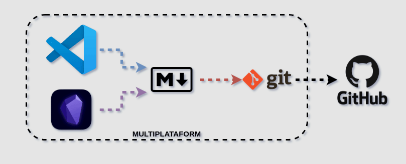
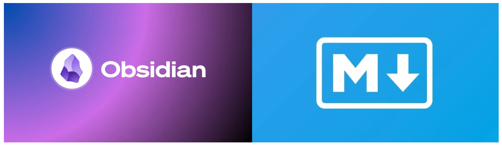

---
date:
  created: 2025-01-02
authors:
  - leonardo
categories:
  - Leonardo Pangaio
comments: true
slug: utilizacao-de-diario-em-2025
---

# Utilização de Diário em 2025

Continuando com o assunto estudos, organização, anotações e etc... Resolvi escrever sobre como tenho organizado a minha vida, meu dia a dia, tanto pessoal quanto profissional.

Em um super resumo, eu diria que a adoção de um diário e utilização de uma agenda (seja ela qual for) é o que tem me salvado bastante.

<!-- more -->

Com relação a utilização de um diário, eu estou no meio de uma transição de tecnologias e aprendendo um pouquinho da nova. Eu utilizava o [Microsoft OneNote](https://www.onenote.com) para realizar as anotações do meu dia a dia, e estou migrando para o [Obsidian](https://obsidian.md/) para esta tarefa. Mas sendo bem sincero, um repositório no [Github](https://github.com/), uma pasta no [Google Drive](https://drive.google.com) ou no [OneDrive](https://onedrive.live.com) com arquivos [markdown](https://www.markdownguide.org/) ou documentos word já funcionaria.

O intuito do diário é anotar as atividades, com os horários e anotações extras, podendo ser arquivos em anexo, links, imagens, documentos, ou qualquer outro tipo de artefato que seja útil para relembrar daquela atividade no futuro. Seja para lembrar do que foi dito em uma reunião, seja para lembrar de como um problema técnico foi resolvido, seja para lembrar dos passos que foram seguidos para realização de uma determinada atividade. A granularidade e o detalhamento fica a cargo de quem está escrevendo o diário, pois quem vai ler esse diário e utilizar ele, é o próprio autor.

Este diário pode ser dividido em seções por assunto, por trabalho, por vida pessoal, por área de conhecimento ou qualquer outro tipo de divisão que faça sentido para o próprio autor. No meu caso, eu utilizo uma seção chamada de diário, uma seção só de listas de tarefas, como se fosse um to-do pra eu lembrar das tarefas que tenho que fazer (conforme essas tarefas vão sendo feitas, elas vão sendo marcadas e referenciadas com a seção diário) e uma última seção de snippets de código, onde eu vou anotando códigos úteis, consultas de banco, relatórios, configurações e etc... que possam ser úteis em outros momentos.

Estou realizando essa migração para [Markdown](https://www.markdownguide.org/) e [Obsidian](https://obsidian.md/), para simplificar a busca de informações e simplificar a escrita. O [Microsoft OneNote](https://www.onenote.com) é muito bom, contudo a migração a partir dele para outros formatos não é tão simplificada (devo escrever um outro artigo mais pra frente explicando como eu fiz essa migração) e o compartilhamento de informações a partir dele também não é muito boa. O [OneNote](https://www.onenote.com) para web é meio fraco para busca de informações em grandes quantidades de dados, já o [Obsidian](https://obsidian.md/) ou até mesmo o [Microsoft Visual Studio Code](https://code.visualstudio.com/) fazem essa busca em arquivos de texto como [Markdown](https://www.markdownguide.org/) em questões de segundos.

Já a utilização de agendas, tem me ajudado a não ter conflitos de atividades agendadas, parece óbvio, mas aprendi com o tempo que o óbvio também deve ser dito e testado. Atualmente tenho duas agendas, uma para itens pessoais e uma para tarefas do trabalho, e é bem comum que faço anotações em ambas, para que não me gerem conflitos, como por exemplo, marcar um cinema num dia que haverá uma virada de sistema de noite no escritório, ou ainda evitar de marcar algo com os amigos em semana que estou de plantão ou que haja uma manutenção programada.

Um detalhe importante em ambos os casos é a portabilidade. Quero dizer, tanto no caso do diário quanto na agenda, o importante é poder ter essas informações de forma rápida. O diário, como são arquivos textos dentro de um repositório git, no meu caso o [Github](https://github.com/) tenho acesso as informações onde for necessário, se o computador queimar ou desejar mudar de ferramenta, deixar de usar o [Obsidian](https://obsidian.md/) e passar a usar somente o [VS Code](https://code.visualstudio.com/), ou utilizar o [Notion](https://www.notion.com/), os arquivos são de fácil migração. Já no caso das agendas, elas funcionam tanto por aplicações web quanto mobile, então tenho elas sempre a vista. Outro detalhe interessante é que o [OneNote](https://www.onenote.com) também tem um [módulo de markdown](https://onemark.neux.studio/), permitindo a importação e escrita dos documentos neste formato.

diário, dia-a-dia, anotações, documentação, organização, informações, estudos, lembranças, lembrar, tarefas, to-do, tasks, lembretes, agenda, simplificação, buscas, markdown, git, versionamento