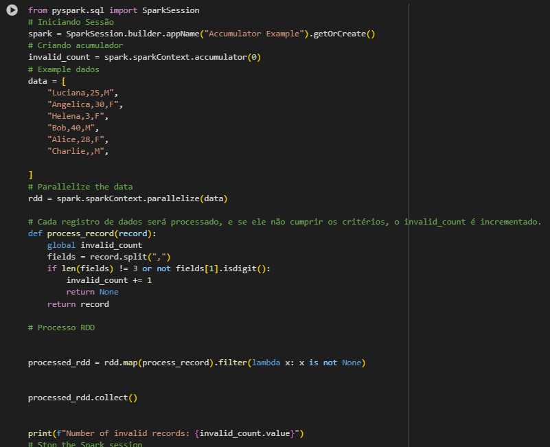
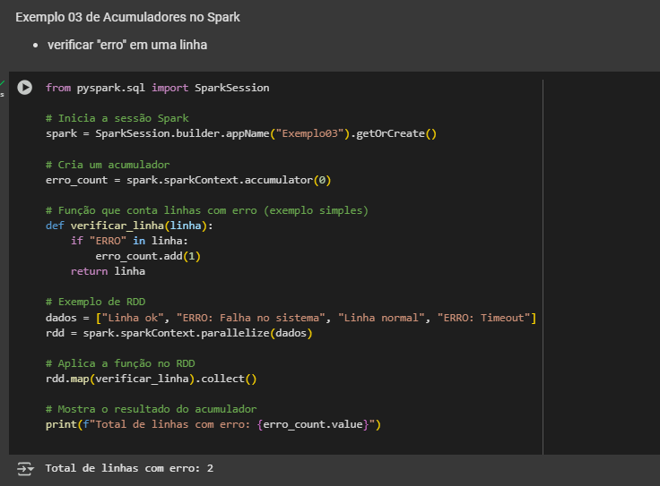
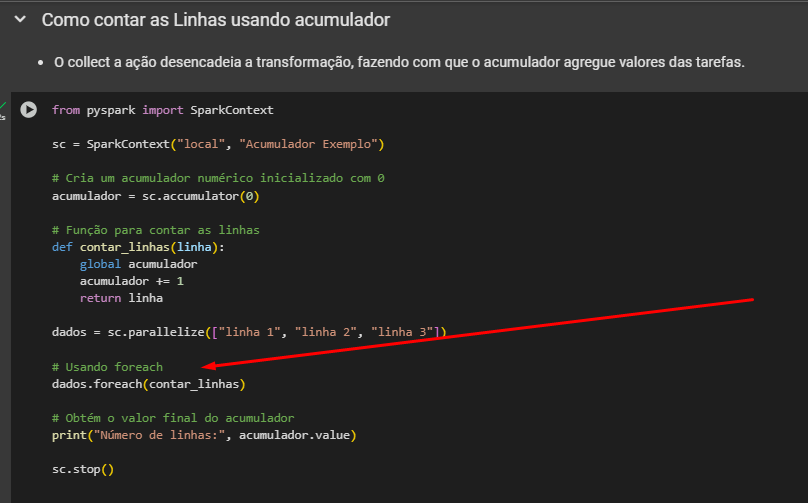

---
date:
  created: 2025-03-25
authors:
  - luciana
categories:
  - Luciana Sampaio
comments: true
slug: acumuladores
tags:
  - Engenharia de Dados
  - pySpark
  - How-to
---

# Acumuladores no PySpark: O que são e como usá-los?

Imagine que você está cozinhando um prato incrível, mas precisa contar quantas vezes adicionou tempero. Agora, multiplique isso por milhares de nós trabalhando juntos! 🍲🔥

No mundo do PySpark, os acumuladores fazem exatamente isso: ajudam a contar e somar valores sem causar caos no cluster!

<!-- more -->

# 🎯 O que são acumuladores?
- São variáveis especiais que só podem ser incrementadas pelos trabalhadores (workers) e lidas - pelo nó principal (driver).
- Perfeitos para agregar métricas, rastrear estatísticas globais e monitorar processos sem - sobrecarregar o Spark.
- Como PySpark trabalha em ambiente distribuído, os acumuladores garantem que informações - essenciais sejam coletadas sem criar um pandemônio na rede!

## Como usar o Acumulador no Pyspark. 

Você pode definir um acumulador no PySpark usando o método `accumulator` disponível no `SparkContext`.

# Por que isso é útil?

- Monitoramento de jobs – Descubrir quantos registros foram processados sem criar gargalos.
- Contagem de erros – Conte exceções sem precisar embaralhar (shuffle) os dados.
- Métricas de desempenho – Meça estatísticas globais sem prejudicar a performance do cluster.
  
---

>  É importante notar que dentro de transformações como map e filter, que retornam um novo RDD, o valor do acumulador será contado para cada registro do novo RDD. Assim é muito comum o uso de acumuladores dentro de ações como o foreach.

Exemplo abaixo:

## Acumuladores Embutidos:
O Spark fornece vários tipos de acumuladores embutidos:
- Long Accumulator: Usado para agregar valores de tipo Longo.
- Dobro Accumulator: Usado para agregar valores de tipo duplo.
- Coleção Accumulator: Acumula elementos em uma coleção no nó do driver.
- Esses acumuladores são projetados especificamente para lidar com seus respectivos tipos de - dados (Longo, Duplo ou Coleção) e são otimizados para desempenho no ambiente distribuído.

## Resumindo 

- Acumuladores são úteis para depuração e monitoramento de trabalhos do Spark.

### Segue meus contatos no que precisar. 

 🌐 [LinkedIn](https://www.linkedin.com/in/luciana-sampaio/)  
  *O lugar onde pareço super profissional e séria. 😉*

 🐙 [GitHub](https://github.com/luasampaio)  
  *Aqui é o cantinho dos meus códigos! Dá uma espiada, mas cuidado com os bugs. 😂*

 📸 [Instagram](https://www.instagram.com/luasampaio/)  
  *Spoiler: mais fotos e menos linhas de código! 📷✨*

*_texto original publicado em [medium.com](https://medium.com/@luciana.sampaio84/acumuladores-no-pyspark-o-que-s%C3%A3o-e-como-us%C3%A1-los-93e8ee4319a6)*