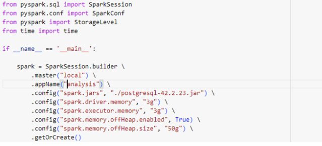
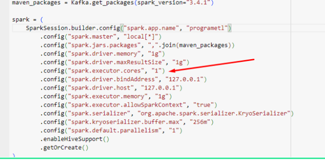

---
date:
  created: 2024-07-02
authors:
  - luciana
categories:
  - PySpark
  - Tech
  - Data Science
comments: true
slug: aplicativos-pyspark-redimensionados
---

# Como os Aplicativos PySpark podem ser redimensionados.

### Como Dimensionar Aplicativos PySpark de Forma Eficiente?

Lidar com o dimensionamento de aplicativos PySpark nem sempre é uma tarefa fácil, especialmente quando estamos falando de **processamentos em larga escala**.  

---

### **Como fazer isso de modo mais eficiente?**

Antes de tudo, é fundamental entender que o **número de nós (executores)** tem um impacto significativo na escalabilidade do seu projeto.  

No entanto, a escolha do tamanho ideal do cluster não depende apenas do tamanho dos dados. Outros fatores também precisam ser considerados, como o poder de processamento (CPU) e a memória disponível.

<!-- more -->

---

### **Fatores a Considerar no Dimensionamento**

Ao olhar para o conjunto de dados a ser processado, é essencial levar em conta:

1. **Memória RAM:**  
   A memória necessária para suportar a carga de trabalho e evitar falhas por falta de recursos.

2. **Carga de Trabalho:**  
   O volume de dados a ser processado e o tipo de operações realizadas (e.g., transformações pesadas, machine learning, etc.).

3. **Requisitos de Armazenamento (Storage):**  
   Certifique-se de que o cluster possui espaço suficiente para lidar com dados intermediários e finais.

4. **Monitoramento Robusto:**  
   Use ferramentas como:
   - **Ganglia**
   - **Prometheus**
   - **Métricas do Spark**
   Para identificar gargalos de recursos e otimizar o desempenho.

---

Ao equilibrar esses fatores, você pode dimensionar seu aplicativo PySpark de maneira mais eficiente, garantindo que ele aproveite ao máximo os recursos disponíveis e processe dados em grande escala com eficiência.

## Algumas configurações do SPARK:

- spark.executor.memory: define a memória do executor com base na RAM disponível, nesse exemplo acima eu definir 3g.
- spark.executor.cores: configura o número de núcleos por executor.

---

- spark.executor.instances: ajusta o número de executores.
- spark.dynamicAllocation.maxExecutors: define limites para alocação dinâmica.

- O paralelismo do Spark depende do produto do número de executores e núcleos por executor.
  
- Ajustar esses parâmetros para obter o paralelismo desejado é um dos pontos essenciais para engenharia de dados com PySpark e processamento de dados em alta escala.

  - ###  Referências sobre Configuração e Dimensionamento do PySpark

Para aprender mais sobre como configurar e dimensionar seus aplicativos PySpark de forma eficiente, confira as seguintes referências:

1. [**Apache Spark Configuration Documentation**](https://spark.apache.org/docs/latest/configuration.html)  
   - Documentação oficial do Apache Spark, detalhando todas as configurações disponíveis para otimizar o desempenho, memória, execução de tarefas e muito mais.

2. [**Configurações do Apache Spark no Azure HDInsight**](https://learn.microsoft.com/pt-br/azure/hdinsight/spark/apache-spark-settings)  
   - Guia específico para ajustar configurações do Spark em ambientes do Azure HDInsight, com foco em escalabilidade e desempenho.

---

##  Meus Contatos! 🌟

Quer bater um papo, trocar ideias, ou só dar aquela stalkeada básica? Não seja tímido! Aqui estão meus canais de comunicação preferidos:

- 🌐 [LinkedIn](https://www.linkedin.com/in/luciana-sampaio/)  
  **O lugar onde pareço super profissional e séria. 😉**

- 🐙 [GitHub](https://github.com/luasampaio)  
  **Aqui é o cantinho dos meus códigos! Dá uma espiada, mas cuidado com os bugs. 😂**

- 📸 [Instagram](https://www.instagram.com/luasampaio/)  
  **Spoiler: mais fotos e menos linhas de código! 📷✨**

- ✍️ [Medium](https://medium.com/@luciana.sampaio84)  
  **Onde compartilho insights, histórias e dicas sobre dados e tecnologia. Dá uma conferida!**

---

Vai lá, segue, curte, comenta ou manda mensagem. Prometo que não mordo (muito)! 😜

*_texto original publicado em [medium.com](https://medium.com/@luciana.sampaio84/como-os-aplicativos-pyspark-podem-ser-redimensionados-b331684b1973)*