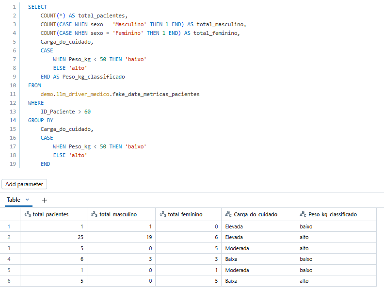
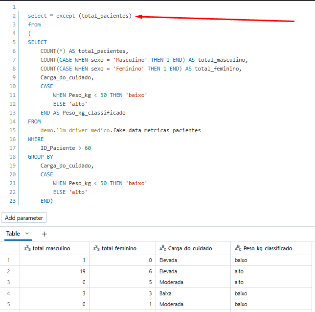
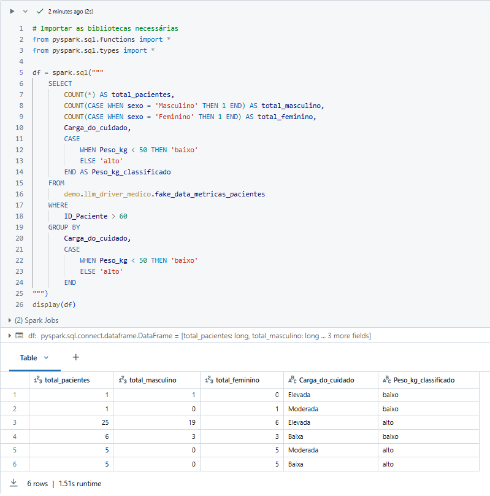
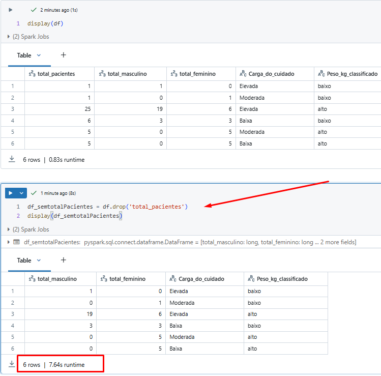

---
date:
  created: 2025-02-14
authors:
  - luciana
categories:
  - PySpark
  - Tech
  - Data Science
comments: true
slug: except-function
---

# Otimizar consultas com EXCEPT 

A função EXCEPT é tipo aquele amigo que ajuda você a se livrar do que não precisa! 😆✨

<!-- more -->

- No dia a dia de uma engenheira de dados, estamos sempre em busca de otimizar consultas e automatizar processos para ganhar tempo e eficiência. ⏳🚀
- Algumas pessoas podem até dizer que somos meio preguiçosos… mas isso é intriga da oposição! 😆 A verdade é que só automatiza quem pensa à frente! 😉🔥

- Esse é um exemplo bem básico! Somente um "Count". 

- Essa função é top demais! 🤩 Principalmente quando quero eliminar 10 colunas de uma vez sem enlouquecer! E o melhor de tudo?
-  Quando preciso gerar o mesmo relatório para várias pessoas, posso simplesmente definir uma coluna de exceção e pronto! 

Por exemplo, ao carregar um DataFrame com a biblioteca PySpark, podemos eliminar etapas desnecessárias, tornando o fluxo mais eficiente. 

Reduzir passos não é apenas uma questão de organização, mas também de **performance**: menos processamento, menor consumo de recursos do cluster e, claro, **mais velocidade na entrega dos dados!** 🚀

- Dropar a coluna "total_Pacientes" pode parecer uma tarefa simples, mas no fundo é um verdadeiro devorador de recursos! 🦖💥

- Agora, imagine isso rodando em uma BigQuery com toneladas de dados… Se cada operação custa processamento, por que gastar mais do que precisamos? 

- Ao otimizar essa remoção, economizamos tempo, dinheiro e ainda deixamos nossos scripts rodando como um foguete! 🚀✨

- Moral da história: nem toda limpeza de dados precisa ser uma missão impossível. 

- Quanto mais eficiente formos, mais rápido chegamos ao nosso destino! 😉

- Com EXCEPT, você simplesmente diz: "Quero tudo, menos essas colunas aqui!" e pronto, sua consulta fica mais leve e rápida, sem precisar listar uma por uma. 🚀💡

---

## Gostou do conteúdo?  
Se você curtiu, não esquece de dar aquele **aplauso maroto** e clicar no botão **seguir**! Isso me ajuda muito a continuar compartilhando conteúdos incríveis com você.  

Obrigada pelo apoio! 🚀👏  

---

##  Meus Contatos! 🌟
Quer bater um papo, trocar ideias, ou só dar aquela stalkeada básica? Não seja tímido! Aqui estão meus canais de comunicação preferidos:

- 🌐 [LinkedIn](https://www.linkedin.com/in/luciana-sampaio/)  
  **O lugar onde pareço super profissional e séria. 😉**

- 🐙 [GitHub](https://github.com/luasampaio)  
  **Aqui é o cantinho dos meus códigos! Dá uma espiada, mas cuidado com os bugs. 😂**

- 📸 [Instagram](https://www.instagram.com/luasampaio/)  
  **Spoiler: mais fotos e menos linhas de código! 📷✨**

- ✍️ [Medium](https://medium.com/@luciana.sampaio84)  
  **Onde compartilho insights, histórias e dicas sobre dados e tecnologia. Dá uma conferida!**

---

Vai lá, segue, curte, comenta ou manda mensagem. Prometo que não mordo (muito)! 😜

*_texto original publicado em [medium.com](https://medium.com/@luciana.sampaio84/otimizar-consultas-com-except-0233c3b44881)*