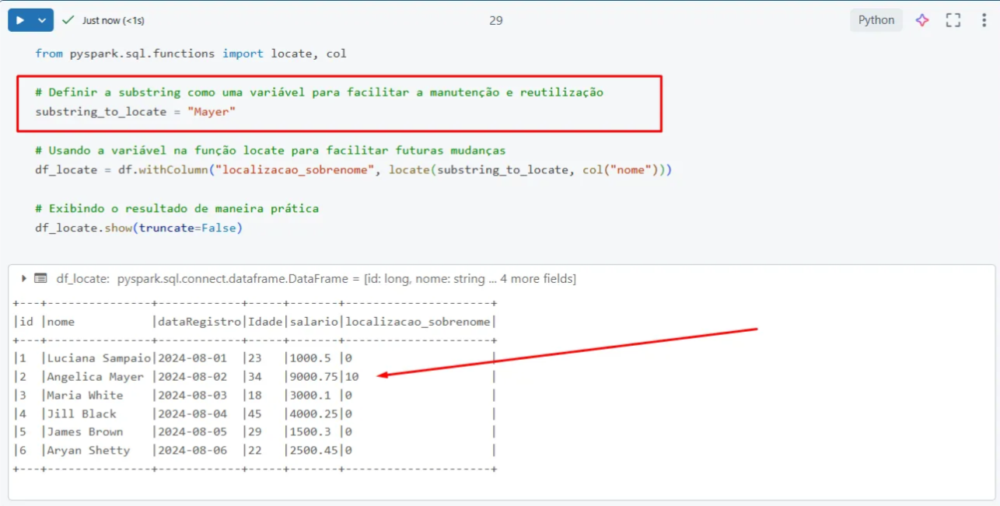
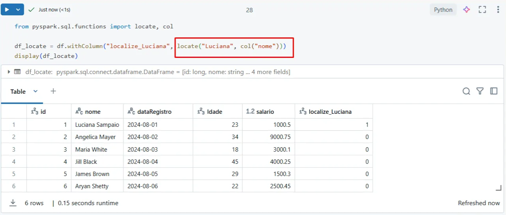
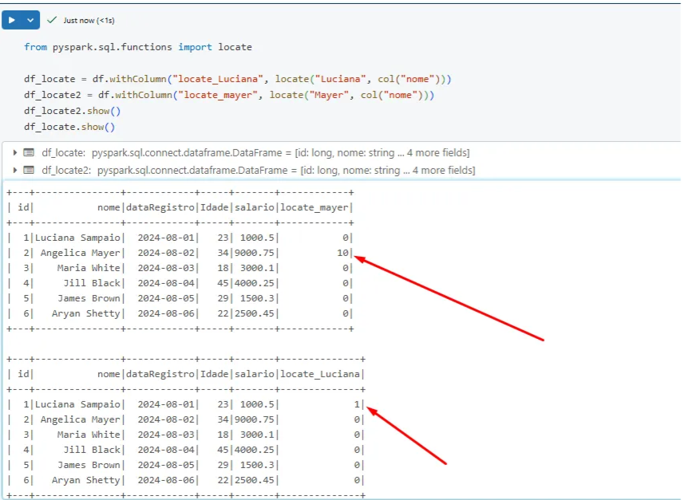
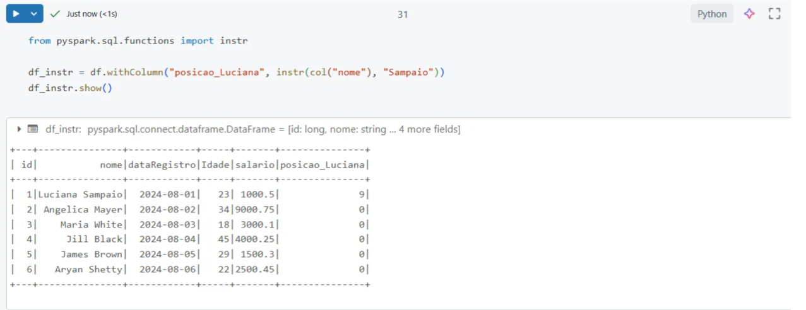

---
date:
  created: 2024-11-15
authors:
  - luciana
categories:
  - PySpark
  - Tech
  - Data Science
comments: true
slug: pyspark
---

## PySpark

### Afinal o que são funções?

Afinal, o que são funções? 🤔
Se a gente fizer um paralelo com a etimologia da palavra "função", dá pra pensar em algo que expressa ou controla um comportamento – só que, no mundo da programação, isso rola por meio de código. Legal, né? Ou talvez até meio nerd, rs.

Eu gosto de pensar que funções são as ferramentas mágicas do desenvolvedor. Tipo aquela “caixa de ferramentas” onde você encontra tudo que precisa pra fazer magia com os dados. Quer somar colunas? Beleza. Transformar texto pra minúsculas? Fácil. Ordenar, calcular média, e até umas coisas mais avançadas? Tá tudo lá, prontinho pra usar. 🚀

<!-- more -->

E por que focar no PySpark?
Ah, meu amigo, quando o assunto é PySpark, estamos falando de lidar com montanhas de dados. Big data, sabe? Aqueles bilhões de registros que podem travar o Excel e fazer o banco de dados chorar. 😂 Saber usar funções no PySpark é como ter superpoderes.

> Função Locate

  - O **locate()**  é basicamente o Sherlock Holmes das suas colunas. Ele serve para encontrar onde um determinado valor (ou substring) aparece dentro de uma coluna de texto.

 
 - Mas diferente de um simples "achar" como por exemplo o  **instr()** , ele pode começar a busca a partir de uma posição específica.
  
 É como falar: “Ei, Sherlock, começa a procurar a partir do meio do livro, tá bom?”

- Ele procura por uma palavra ou parte de um texto em uma coluna e te devolve a posição em que encontrou essa palavra. Se ele não encontrar nada, ele devolve zero – é como se dissesse: "Nada aqui, parceiro."

Confesso que pirei nessa função achei ela sensacional. 

#  O que Está Acontecendo Aqui? 🤔

locate("Luciana", col("nome")):

- Aqui, você está dizendo ao Spark: “Ei, procura aí a palavra ‘Luciana’ dentro da coluna nome."
- Ele vai olhar em cada linha da coluna "nome" e te dizer a posição em que a palavra "Luciana" aparece pela primeira vez.

Bora testar outro nome, então! Afinal o que mais gostamos é entender sobre dados. Agora com uma substring.

Pedi para encontrar "Mayer" e para adicionar no nome coluna “locate_mayer” e ele me mostrou exatamente a posição 10 e se ele não tiver encontrado nada , vai mostrar 0.

 - Sério curti demais essa função!

# Comparando com instr()
O instr() é parecido, mas ele não permite que você comece a busca de uma posição diferente. É mais direto: "Ache essa palavra e pronto". O locate(), por outro lado, te dá mais flexibilidade, já que você pode dizer: “Começa a procurar daqui pra frente.”

Pense no instr() como alguém folheando um livro desde a # Diferença entre `instr()` e `locate()`

### Imagine assim:
- **`instr()`**:  
  É como alguém folheando um livro desde a primeira página até encontrar o que quer.  
  (*Bem metódico e organizado!*)  

- **`locate()`**:  
  É aquela pessoa esperta que já começa a busca na página que acha mais interessante. 😉  
  (*Prático e direto ao ponto!*)  

---

### Por que usar o `locate()`?
O **`locate()`** é perfeito quando você precisa ter mais controle sobre onde começar a busca, pois ele permite especificar um ponto de partida.

---

### Observações importantes:
1. **Case-sensitive:**  
   O `locate()` diferencia maiúsculas de minúsculas.  
   Se quiser ignorar isso, use funções como `lower()` ou `upper()` para padronizar os textos antes da busca.

2. **Cuidado com valores nulos:**  
   Certifique-se de que a coluna onde está pesquisando não contenha valores `null`.  
   Isso evita erros ou comportamentos inesperados durante a execução.

---

Agora você sabe: dependendo do cenário, escolha o método certo e otimize suas consultas! 🚀  

*_texto original publicado em [medium.com](https://medium.com/@luciana.sampaio84/fun%C3%A7%C3%B5es-em-pyspark-0d70b5bb5946)*