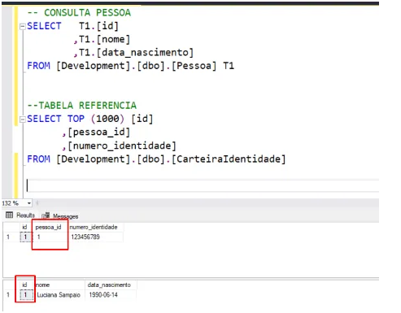
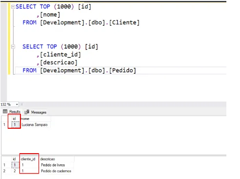
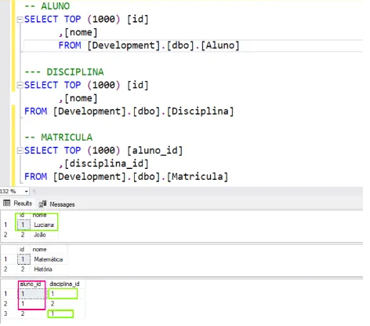

---
date:
  created: 2024-11-19
authors:
  - luciana
categories:
  - Luciana Sampaio
comments: true
slug: pyspark-context
---

# Ah, relacionamentos no SQL?

Pense nisso como dramas de relacionamento, mas entre tabelas de dados! 😂 Vamos lá:

1. Relacionamento de “Um pra Um” (1:1)
Esse é aquele namoro exclusivo, onde cada item em uma tabela só pode estar com um único item em outra tabela. Nada de triangulo amoroso aqui!

Exemplo: Uma tabela de pessoas e uma tabela de carteira de identidade. Cada pessoa tem uma carteira, e cada carteira pertence a uma única pessoa. Bem monogâmico.

<!-- more -->

# 1. Relacionamento de “Um pra Um” (1:1)
Esse é aquele namoro exclusivo, onde cada item em uma tabela só pode estar com um único item em outra tabela. Nada de triangulo amoroso aqui!

Exemplo: Uma tabela de pessoas e uma tabela de carteira de identidade. Cada pessoa tem uma carteira, e cada carteira pertence a uma única pessoa. Bem monogâmico.

Olha só, no mundo do SQL, exclusividade é tudo! 🕶️ Minha tabela Pessoa é tipo aquele amigo especial: tem um id único, só dela, e ninguém mais pode copiar. ✨

Agora, a minha outra tabela, CarteiraIdentidade, tá super ligada na exclusividade também. Ela usa o pessoa_id como referência pra dizer: “Ei, essa identidade aqui pertence só a essa pessoa da tabela Pessoa!”

Em resumo: o id da Pessoa é tipo um RG digital, exclusivo e inconfundível, e a CarteiraIdentidade tá lá pra reforçar essa amizade única entre as tabelas! 🎉

# 2. Relacionamento Um-para-Muitos (1)
Aqui já estamos falando de famílias. Uma pessoa (pai/mãe) pode ter vários filhos (tabelas relacionadas), mas cada filho só pode ter um pai ou uma mãe (chave estrangeira, bebê!).

Exemplo: Uma tabela de clientes e uma tabela de pedidos. Cada cliente pode fazer vários pedidos, mas cada pedido pertence a um único cliente. Bem família grande!

Imagina só: o relacionamento um-para-muitos é tipo aquela pessoa que é a alma da festa 🎉. Ela conhece geral, é super popular, mas o rolê é que toda essa galera só conhece ela. Ou seja, é o mestre da festa! 🕺💃

No nosso mundo SQL, a tabela Cliente é esse mestre: ela tem o seu id único, super especial, que é o cliente_id. E esse cliente_id pode aparecer várias vezes na tabela Pedidos, porque, convenhamos, o mestre da festa tá sempre fazendo pedidos (e compras). 🍕🛍️

Então, em resumo: o cliente é o dono do jogo, e os pedidos são os fãs fiéis que só têm olhos pra ele. Uma relação cheia de glamour e exclusividade!

## 3. Relacionamento de “Muitos pra Muitos” (M)

Esse aqui é o reality show dos relacionamentos. Todos se misturam com todos, mas com uma pequena ajuda de uma tabela intermediária para organizar o caos. Meu amado (SQL) .

Exemplo: Alunos e disciplinas. Um aluno pode fazer várias disciplinas, e uma disciplina pode ter vários alunos. Aí entra a tabela “matrícula” pra fazer o meio de campo. É tipo aquele amigo organizador que faz listas pra tudo!

Agora a gente tá falando de um verdadeiro networking! 🌐 Todo mundo conhece todo mundo, tá tudo interligado, e ninguém fica de fora do rolê. É o tipo de situação onde não tem “eu sozinho aqui”, só vibes de comunidade. 🎓🤝

### No nosso exemplo, temos três tabelas no esquema:

- A tabela Aluno representa as estrelas do evento (os estudantes, claro).
- A tabela Disciplina é tipo o menu de atividades ou workshops. 📚
- E aí vem a tabela Matrícula, que é o organizador do evento, responsável por garantir que cada aluno possa participar de quantas disciplinas quiser. 🎟️
- Então, na prática, o Aluno pode estar em várias disciplinas, e cada disciplina pode ter vários alunos. É o puro suco da integração: ninguém fica pra trás e todo mundo se conecta! 🥳

### Resumo:
- Um-para-Um: Relação exclusiva, tipo um casal fiel.
- Um-para-Muitos: Um influenciador com seus seguidores.
- Muitos-para-Muitos: Todo mundo conhece todo mundo, e a fofoca rola solta (com - tabelas intermediárias para organizar o caos).

# Como isso funciona no dia a dia?

Esses relacionamentos são representados pelas **chaves primárias (PK)** e **chaves estrangeiras (FK)**.  

---

### Pense assim:
- **PK (Primary Key):**  
  É como o CPF exclusivo de cada linha no banco de dados.  
  *"Eu sou eu, e ninguém é como eu!"*  
- **FK (Foreign Key):**  
  É a conexão emocional que liga uma tabela a outra.  
  *"Eu pertenço a você!"*  

---

Agora que você sabe, pode contar pra galera que trabalhar com SQL é como ser o terapeuta de relacionamentos do banco de dados.  

Ajuda eles a manterem a ordem no caos das interações! 😄  

---

## Gostou do conteúdo?  
Se você curtiu, não esquece de dar aquele **aplauso maroto** e clicar no botão **seguir**! Isso me ajuda muito a continuar compartilhando conteúdos incríveis com você.  

Obrigada pelo apoio! 🚀👏  

---

##  Meus Contatos! 🌟
Quer bater um papo, trocar ideias, ou só dar aquela stalkeada básica? Não seja tímido! Aqui estão meus canais de comunicação preferidos:

- 🌐 [LinkedIn](https://www.linkedin.com/in/luciana-sampaio/)  
  **O lugar onde pareço super profissional e séria. 😉**

- 🐙 [GitHub](https://github.com/luasampaio)  
  **Aqui é o cantinho dos meus códigos! Dá uma espiada, mas cuidado com os bugs. 😂**

- 📸 [Instagram](https://www.instagram.com/luasampaio/)  
  **Spoiler: mais fotos e menos linhas de código! 📷✨**

- ✍️ [Medium](https://medium.com/@luciana.sampaio84)  
  **Onde compartilho insights, histórias e dicas sobre dados e tecnologia. Dá uma conferida!**

---

Vai lá, segue, curte, comenta ou manda mensagem. Prometo que não mordo (muito)! 😜

*_texto original publicado em [medium.com](https://medium.com/@luciana.sampaio84/relacionamentos-no-sql-d2b72d26d205)*