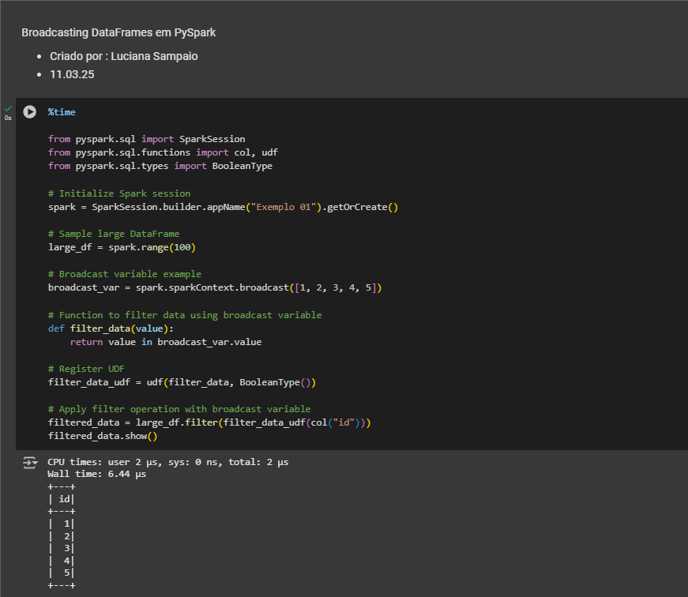
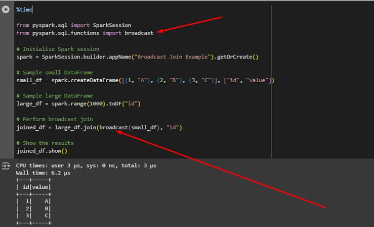

---
date:
  created: 2025-03-11
authors:
  - luciana
categories:
  - Luciana Sampaio
comments: true
slug: broadcast-variavel
tags:
  - Engenharia de Dados
  - Databricks
---

# 📢 **Broadcast: O Wi-Fi da Engenharia de Dados!**  

Fala, pessoal! Hoje vou falar sobre **variável de transmissão (Broadcast)**, mas antes... bora filosofar um pouco sobre o que faz um **Engenheiro de Dados**?  

🤔 Já parou para pensar? Qual é uma das grandes missões desse ser místico que habita planilhas, bancos de dados e clusters Spark?  

<!-- more -->

Na minha visão, além de sobreviver a reuniões intermináveis, um engenheiro de dados tem que garantir que os dados estejam **limpos, íntegros, governados** e, mais importante, **disponíveis para o negócio antes que alguém venha perguntar "e os dados de ontem?"**.  

Agora, se estamos falando de um cenário de **computação distribuída**, como no Apache Spark, temos que ter um conceito muito claro: **ninguém gosta de esperar!**  

E é aí que entram os **5 Vs do Big Data** (ou, como gosto de chamar, "Os 5 Cavaleiros do Apocalipse de Dados"):  

- **📦 Volume** – O tanto de dados que temos que lidar diariamente. Tipo aquele grupo de família do WhatsApp com 500 mensagens por hora.  
- **⚡ Velocidade** – A rapidez com que os dados chegam e precisam ser processados. Lembra do tempo de resposta da sua internet quando mais precisa? Pois é, aqui não pode falhar.  
- **🎭 Variedade** – Dados vêm de tudo quanto é tipo: estruturados, semiestruturados e aquele caos não estruturado que mais parece um código-fonte sem tabulação.  
- **🔍 Veracidade** – Dados confiáveis? Nem sempre. Por isso, precisamos filtrar as fake news... digo, os dados ruins.  
- **💰 Valor** – Se os dados não gerarem insights que prestam, de nada adianta. Ou seja, fazer gráfico bonito sem utilidade não paga as contas!  

Agora, para explicar de um jeito mais prático, adoro comparar um engenheiro de dados com um advogado (calma, advogados, sem processos aqui! 😆).  

- O advogado **interpreta** as leis para defender seu cliente.  
- O engenheiro de dados **interpreta** os dados e usa métodos certos para distribuir e processar tudo da forma mais eficiente possível.  

No fundo, ambos precisam conhecer bem as regras do jogo. E se o advogado dá um jeito de "otimizar" as leis, nós fazemos o mesmo com os dados. 🚀  

---

## 🎯 **Agora, bora falar do método Broadcast!**  

Pensa no Broadcast como um **Wi-Fi VIP** dos dados dentro do Spark. Em vez de toda hora ficar mandando os mesmos dados pela rede (tipo aquele parente que pergunta 3 vezes a mesma coisa), ele manda **uma única vez para todos os nós** e deixa cada um com uma cópia local.  

Resultado? 🚀 Menos tráfego na rede, menos espera e mais eficiência!  

### 🤔 **Mas por que eu deveria usar Broadcast?**  

Sem Broadcast:  
📦 Cada nó recebe os dados várias vezes, congestionando a rede. 

Com Broadcast:  
✅ O dado é enviado **uma única vez** e os nós guardam uma cópia local.  

- Nesse exemplo realizei um join com uma massa de 100 registros e fiz uso de uma função para filtrar os dados. 
- No momento do "join" usei o 'id' como um campo chave. 

🚨 **Mas calma, pequeno gafanhoto!** 🚨  

Isso só funciona bem para **pequenos conjuntos de dados**. Se você der um **dataset gigante**, vai estourar a memória do seu nó e sua execução vai falhar mais rápido do que aquela dieta que você começou na segunda-feira.  

Então, resumindo: **Use com sabedoria!**  

E aí, curtiu?! 

##  Meus Contatos! 🌟
Quer bater um papo, trocar ideias, ou só dar aquela stalkeada básica? Não seja tímido! Aqui estão meus canais de comunicação preferidos:

- 🌐 [LinkedIn](https://www.linkedin.com/in/luciana-sampaio/)  
  **O lugar onde pareço super profissional e séria. 😉**

- 🐙 [GitHub](https://github.com/luasampaio)  
  **Aqui é o cantinho dos meus códigos! Dá uma espiada, mas cuidado com os bugs. 😂**

- 📸 [Instagram](https://www.instagram.com/luasampaio/)  
  **Spoiler: mais fotos e menos linhas de código! 📷✨**

- ✍️ [Medium](https://medium.com/@luciana.sampaio84)  
  **Onde compartilho insights, histórias e dicas sobre dados e tecnologia. Dá uma conferida!**

---

Vai lá, segue, curte, comenta ou manda mensagem. Prometo que não mordo (muito)! 😜

*_texto original publicado em [medium.com](https://medium.com/@luciana.sampaio84/broadcast-o-wi-fi-da-engenharia-de-dados-a388100ad99d)*