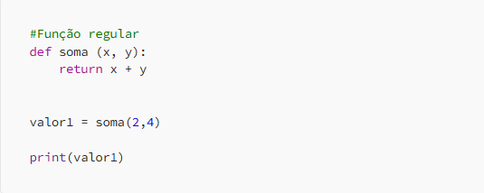
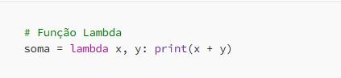
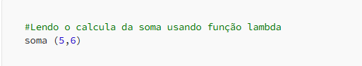

---
date:
  created: 2024-01-03
authors:
  - luciana
categories:
  - Python
  - Functions
  - Tech
comments: true
slug: lambda-function
---

# O que é uma função lambda? 🤔

Ah, funções lambda... O que seriam elas? Nada mais, nada menos que **funções sem nome**! Isso mesmo, é tipo aquele colega que você conhece de vista, mas nunca sabe o nome. 🤷‍♀️

A ideia aqui é simples: elas são feitas para serem pequenas, rápidas e diretas ao ponto. Ou seja, são as "funções ninja" do Python. 🥷🐍

Enquanto em uma função regular você precisa de toda uma cerimônia — *"declara, define, passa parâmetros, dá nome, e blá-blá-blá"* — a lambda chega, resolve o que precisa e sai sem nem pedir crédito. **Elegância pura.**

<!-- more -->

### Função Regular vs Lambda  
Olha só a diferença:

Viu? A lambda é tipo aquela pessoa prática que resolve tudo com uma frase só. Então, se você precisa de algo rápido e sem enrolação, é só chamar a função lambda. 🚀

### Simples assim!

Se puderem dar aquele like camarada, juro que envio boas vibes de pipelines sem erro pra vocês! 🚀

### Meus Contatos! 🌟

Quer bater um papo, trocar ideias, ou só dar aquela stalkeada básica? Não seja tímido! Aqui estão meus canais de comunicação preferidos:

📎 [LinkedIn](https://www.linkedin.com/in/luciana-sampaio/) : Aqui eu finjo ser super séria.

🐙 [GitHub](https://github.com/luasampaio)  : Onde meu código tenta brilhar.

📸 [Instagram](https://www.instagram.com/luasampaio/) : Spoiler: mais fotos e menos linhas de código!

Vai lá, segue, curte, comenta ou manda mensagem. Prometo que não mordo (muito)! 😜

*_texto original publicado em [medium.com](https://medium.com/@luciana.sampaio84/fun%C3%A7%C3%A3o-lambda-python-57818f90525f)*