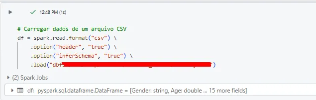
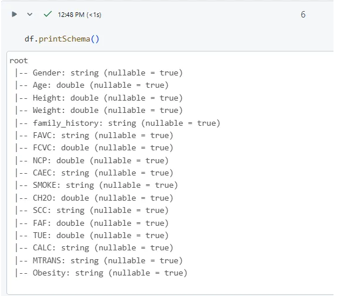
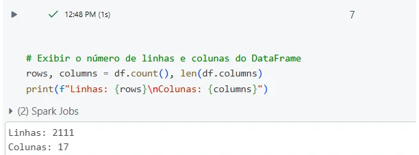
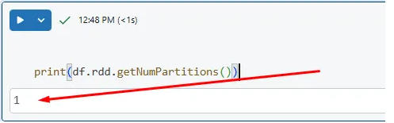
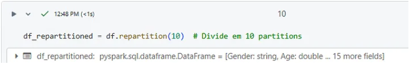
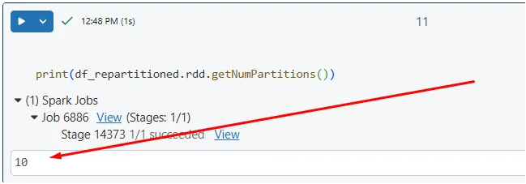
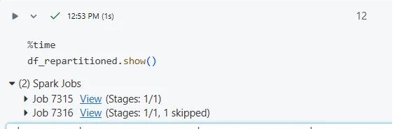
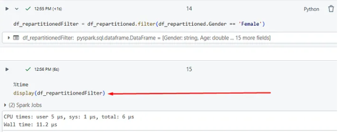
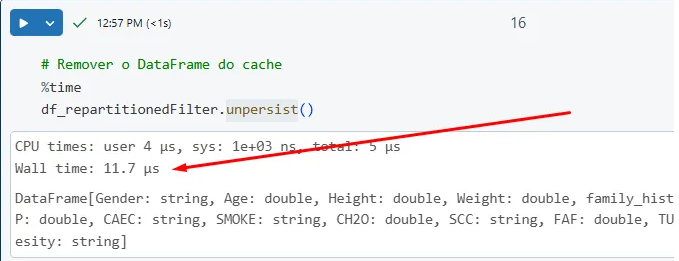
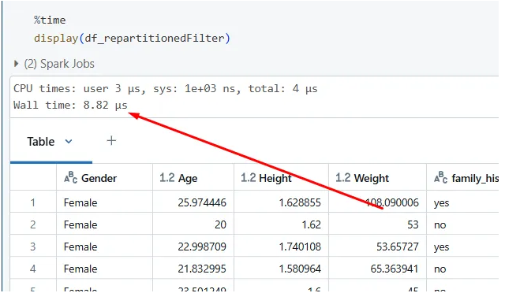

---
date:
  created: 2025-01-14
authors:
  - luciana
categories:
  - Luciana Sampaio
comments: true
slug: unpersist-pyspark
---

# O que é unpersist() em PySpark?

O método `unpersist()` é eficaz para liberar recursos em processos de batch, onde você pode controlar quando o cache não é mais necessário. Em streaming, no entanto, o uso de `unpersist()` não é recomendado, pois os dados são processados continuamente e o checkpoint já cuida da consistência e do armazenamento de estado. A utilização do checkpoint garante que o processo de streaming seja resiliente e possa ser retomado a partir de um ponto de falha, tornando a liberação de memória mais controlada e menos disruptiva.

<!-- more -->

Bora para exemplo?

Carregado dados Spark

A função %time no IPython (ou Jupyter Notebook) é uma maneira prática de medir o tempo de execução de uma única linha de código. Ela retorna o tempo total necessário para a execução do comando, ajudando você a ter uma ideia do desempenho de diferentes trechos de código.

Vou conferir a volumetria do meu DataFrame para entender a quantidade de dados que ele possui. 📈

Vou verificar quantas partições meu DataFrame possui atualmente. 🧐📊

Vou dividir meu DataFrame em 10 partições para aproveitar melhor a magia da computação distribuída. 🚀✨

Veja só, agora temos 10 partições! Um verdadeiro milagre da computação distribuída em ação. 🚀

Ao visualizar os dados, percebemos que eles foram reparticionados. O Spark distribuiu a carga utilizando múltiplas tarefas para executar o processamento.

Foi realizada uma consulta com um filtro básico.

### Consumo da cpu em tempo é de 11.2 milisegundos.

- A ideia agora é eliminar o cache utilizando o método `unpersist()`.

- Nesse passo de limpar o cache, tivemos um pequeno aumento no consumo.

---- 

Agora…aplicado o método .. 8.82 milisegundos.

Com certeza, como PoC, é uma ótima maneira de validar o conceito com um volume menor de dados! Espero que tenha ajudado!

# Meus Contatos! 🌟

Quer bater um papo, trocar ideias, ou só dar aquela stalkeada básica? Não seja tímido! Aqui estão meus canais de comunicação preferidos:

- 🌐 [LinkedIn](https://www.linkedin.com/in/luciana-sampaio/)  
  **O lugar onde pareço super profissional e séria. 😉**

- 🐙 [GitHub](https://github.com/luasampaio)  
  **Aqui é o cantinho dos meus códigos! Dá uma espiada, mas cuidado com os bugs. 😂**

- 📸 [Instagram](https://www.instagram.com/luasampaio/)  
  **Spoiler: mais fotos e menos linhas de código! 📷✨**

- ✍️ [Medium](https://medium.com/@luciana.sampaio84)  
  **Onde compartilho insights, histórias e dicas sobre dados e tecnologia. Dá uma conferida!**

Vai lá, segue, curte, comenta ou manda mensagem. Prometo que não mordo (muito)! 😜

*_texto original publicado em [medium.com](https://medium.com/@luciana.sampaio84/o-que-%C3%A9-unpersist-em-pyspark-b1617acef35b)*